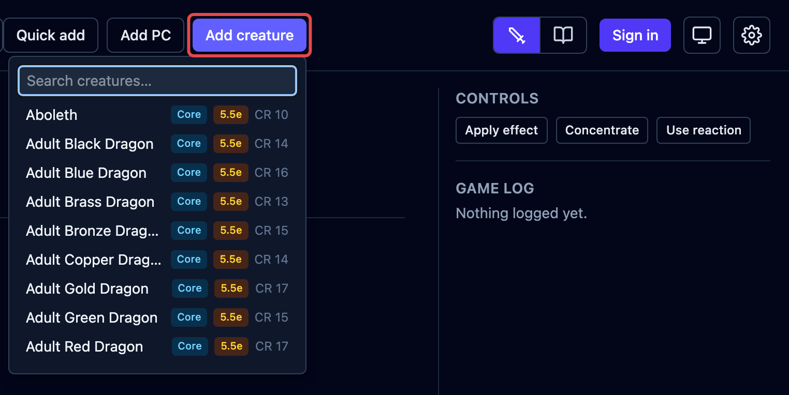
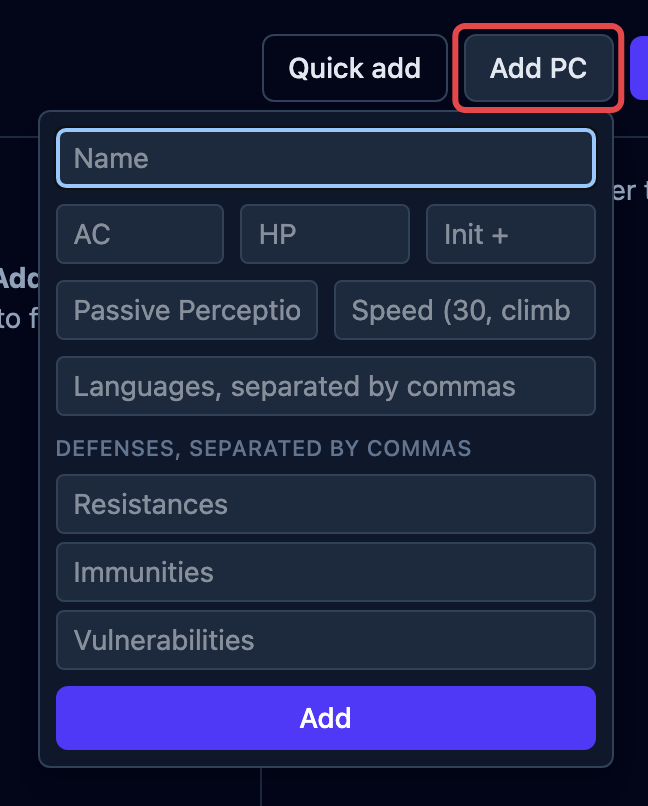
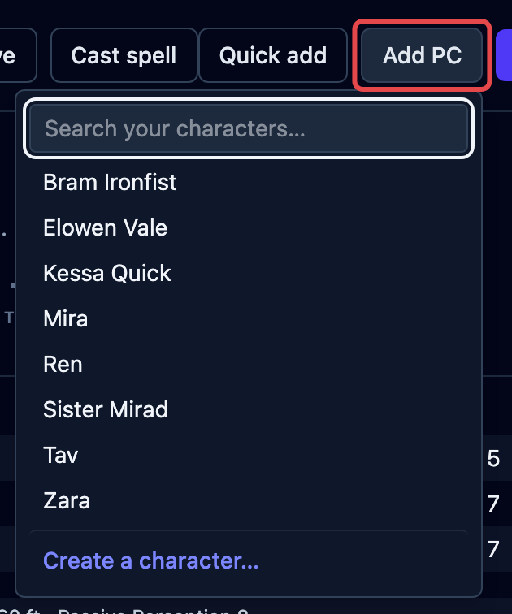
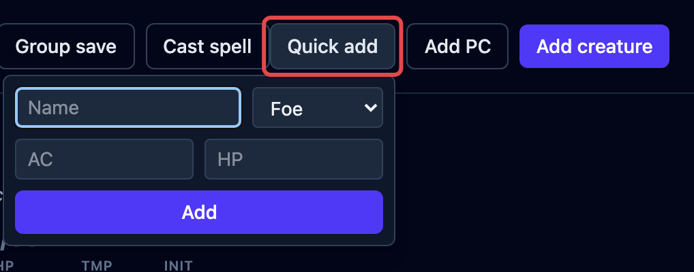
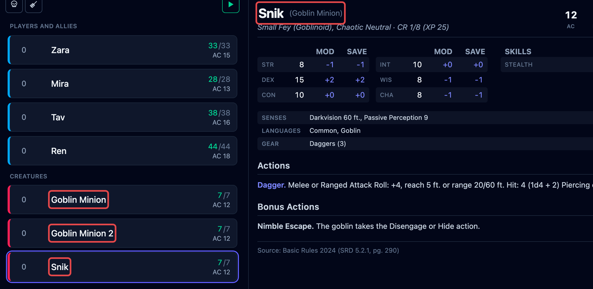

Every combatant in a fight is added in one of three ways. The difference is how much
OpenFray knows about them, and that decides what it can do for them: it rolls for the
combatants it has numbers for, and asks you for the rest. This page explains the three
kinds; the buttons that add them are covered in
[Getting started](/docs/getting-started/#add-your-creatures-and-players).

## Creatures

A **creature** comes from the [compendium](/docs/reference/compendium/), through the
**Add creature** button in the top bar.

You get the whole creature: its abilities, attacks, reactions, legendary actions, and
spells. OpenFray rolls its dice for you, because it has all the numbers.

When you add a creature, OpenFray takes its own copy. Editing the creature in the
library later won't touch one already in a fight, and damage or spells used in a fight
won't change the library.

## Players

A **player character** is added with **Add PC**. The form is short on purpose. It holds
what you, the Game Master, need to see on the board:

- always: name, armor class, hit points, and an initiative bonus;
- optional: passive Perception, speed, languages, and the damage the character resists,
  is immune to, or is vulnerable to.

OpenFray never rolls for a player on its own. Wherever it would roll for a creature, you
type in what the player rolled instead, or choose to let OpenFray roll for them. See
[Honest dice](/docs/concepts/dice/).

When you sign in with your Google or Discord account, you can save your player
characters and add them from the compendium instead:

A saved character can carry more: ability scores, private notes, and its class, level,
and the armor it wears. Those last three feed exactly two numbers, each behind its own
switch. Tick **Calculate AC automatically** and OpenFray works armor class out from the
armor, shield, and ability scores, including the Barbarian and Monk unarmored numbers,
and updates it when the character dons or doffs armor mid-fight. Leave the initiative
modifier blank and it's derived from Dexterity and the class bonuses that touch
initiative. Type either number yourself and your number wins. Everything else about the
character stays yours to write. OpenFray still never runs a build.

## Quick adds

**Quick add** drops in something you're inventing on the spot and won't reuse. It takes
just a name, hit points, armor class, and whether it's a **Friend** or a **Foe**.

## Allies

A creature from the compendium is a foe unless you say otherwise. When one fights for
the party (a summoned wolf, a hired guard, an ogre the bard has just charmed), select it
and click **Make ally** in the controls beside its stat block.

An ally moves in with the players in the tracker, takes the blue row color, and is
offered as an ally when you pick targets. It stops counting toward
[how hard the fight looks](/docs/guides/encounters/#how-hard-the-fight-looks) and the
experience in the [end-of-fight summary](/docs/guides/recap/). On the shared
[player view](/docs/guides/player-view/) it shows in full, like a player character.

The button reads **Ally** once it's one. Click it again to put the creature back on the
other side, mid-fight if the charm wears off.

## Copies and renaming

Add the same creature more than once and a number is added to each new name, so you can
tell them apart. The stat block keeps the original name. If you rename one yourself, it
shows your name with the real one after it (for example _Snik (Goblin)_), so you always
know what it is.

## What each row shows

Once a combatant is on the board, its tracker row shows initiative, name, hit points,
and armor class, and you change hit points right there. The full tour of a row is in
[The tracker](/docs/reference/tracker/).
