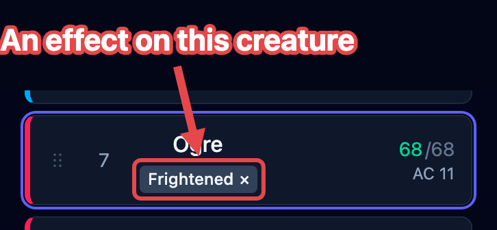

A fight covers a creature in small facts: this one is frightened, that one has
advantage, someone is blessed. In OpenFray every one of these is an **effect**, and they
all work the same way. You tell OpenFray what happened; it remembers it, shows it on the
board, and works it into the right rolls and numbers. This page explains the model. The
steps for putting an effect on a creature are in
[Apply & manage effects](/docs/guides/effects/).

## The kinds of effect

Whatever spell or ability caused it, what lands on a creature is always one of these:

| Kind                                  | Examples                                             |
| ------------------------------------- | ---------------------------------------------------- |
| **A condition**                       | Prone, Frightened, Paralyzed, Poisoned               |
| **Attacks against it have advantage** | Faerie Fire, attacking a prone creature in melee     |
| **Its own rolls have disadvantage**   | Vicious Mockery, Bane                                |
| **A bonus or penalty to rolls**       | Bless (+1d4), Bane (−1d4), +10 to Stealth            |
| **A change to its numbers**           | +2 to armor class, Speed halved, −10 HP maximum      |
| **A reminder**                        | a note to yourself, like "Hex: +1d6 on a hit"        |
| **Ends on a save**                    | something a saving throw shakes off                  |
| **A counter**                         | a tally you raise and lower, like a corruption track |
| **A level of Exhaustion**             | 1 to 6, with the penalties each level brings         |

Conditions are one kind of effect among the rest, so there's only one thing to learn.

## Effects change rolls and numbers

An effect is worked into everything it touches, on its own:

- Advantage and disadvantage from effects are rolled into attacks and saves, whichever
  side is rolling. One of each cancels out.
- A bonus like Bless's +1d4 is added to the roll and shown beside it.
- A modifier aimed at armor class, Speed, or the hit point maximum changes the number
  itself. The stat block and the tracker row show the changed value for as long as the
  effect lasts, and rolls and damage use it.

When an effect lowers the hit point maximum below the creature's current hit points, the
current hit points drop to match. They don't spring back when the effect ends.

A **reminder** is the exception. OpenFray shows it and keeps it in front of you; it
doesn't apply anything for you. A reminder is a note, and you decide what it means.

## How long effects last

Every effect knows when it ends. Some count down in rounds, and the board shows what's
left ("10 rounds left"). Some clear on their own at the right moment:

- effects hung on a **turn** clear at the start or the end of that turn. The turn can
  belong to anyone on the board, so a fear can end when the creature that caused it acts
  again;
- effects marked **or its next roll** also clear on the first roll they change (Vicious
  Mockery), whatever their duration says. OpenFray never sees a player's own rolls, so
  for a player the duration is what ends it;
- effects that last a set time clear when it runs out, and show the time when OpenFray
  can't count it in rounds ("1 hour left");
- the rest stay until you clear them.

### Effects a saving throw ends

Some effects hang on until the creature makes a saving throw: a paralysis, an ongoing
burn. Each one carries its own save, with the ability, the DC, and whether it's rolled
at the start or the end of the creature's turn. Two effects that happen to need the same
save still roll separately. On a creature's turn, OpenFray makes these saves for it at
the right moment; a player rolls their own, and you record it.

## Bundles

One spell often lands several parts at once: Haste is +2 armor class, advantage on
Dexterity saves, doubled Speed, and a reminder about the extra action. Parts applied
together under a name become a **bundle**: one badge on the row, one **Clear all**, and
one fate. Clear the bundle and everything it applied goes with it; when a save ends a
bundled effect, the whole bundle ends, because the save ends the spell.

Counters and Exhaustion always stand alone. A tally outlives whatever applied it, and a
level of Exhaustion belongs to the creature, so neither joins a bundle.

## Where effects show

Each effect shows as a small **badge** under the combatant's name in the tracker: just
the name, so the row stays easy to read. A bundle shows one badge with its name; point
at it to read what's inside.

The details live in the **Applied effects** list, in the controls beside the stat block.
That's where each effect's buttons are: clearing it, rolling its save, or hiding it from
the shared [player view](/docs/guides/player-view/). The buttons are covered in
[Apply & manage effects](/docs/guides/effects/#the-applied-effects-list).

## Counters

Some things at the table are a number that goes up and down: a homebrew corruption
track, a countdown you're running. A **counter** is an effect that holds that number for
you, shown on the row as a badge with the number in it.

OpenFray never changes a counter. It doesn't tick down at the end of a turn, it survives
a long rest, and reaching any particular number does nothing on its own. You raise it,
lower it, and decide what it means when it gets high. Every change is written into the
[game log](/docs/reference/game-log/), so you can retrace how a number got where it is.

## Exhaustion

Exhaustion is the one condition that isn't on or off. It's a level from 1 to 6, and each
level costs the creature more. OpenFray holds the level and works its penalties into
rolls and numbers, the same way it works in any other effect.

What a level does depends on which rules your campaign plays, so OpenFray reads that
from the campaign you're running (see
[Set up a campaign & house rules](/docs/guides/campaigns/)). Without a campaign it uses
the 2024 rules:

- **Basic Rules 2024** — every d20 roll the creature makes drops by 2 for each level,
  and its Speed drops by 5 feet for each level. At level 3 that's −6 and −15 feet.
- **Basic Rules 2014** — each level adds a new penalty on top of the ones below it:
  Disadvantage on ability checks at 1, Speed halved at 2, Disadvantage on attack rolls
  and saving throws at 3, the hit point maximum halved at 4, and Speed 0 at 5.

Switching a campaign doesn't rewrite a level already on the board. Set the level again
and OpenFray rebuilds it for the rules you're playing now.

:::caution[Level 6 is yours to apply]
A creature at level 6 dies. OpenFray shows that as a reminder and does nothing else. It
never kills a creature for reaching a number, and it never removes a level at a long
rest either. Both are your call.
:::

## Concentration

A spell the caster concentrates on is a special case: its effects live and die with the
caster's concentration, everywhere at once. Concentration has its own guide,
[Track concentration](/docs/guides/concentration/).

## Presets

A bundle you apply more than once (a disease stage, a house rule, _Drunk_) can be saved
as a **preset** and applied again in any fight. Some libraries ship presets of their
own. See [Presets](/docs/guides/effects/#presets).
