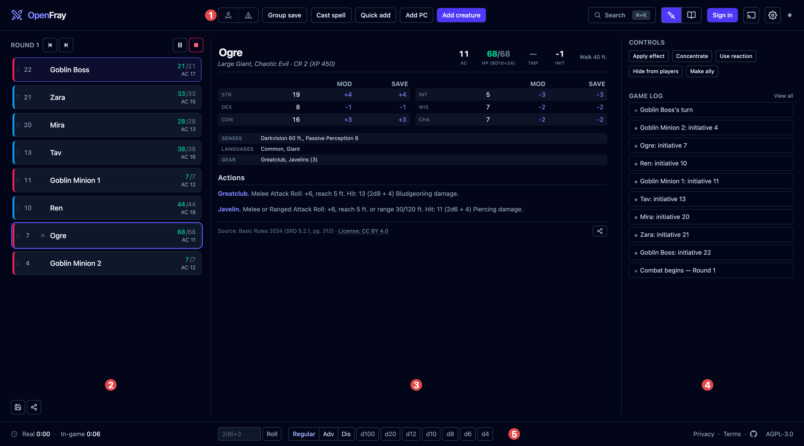
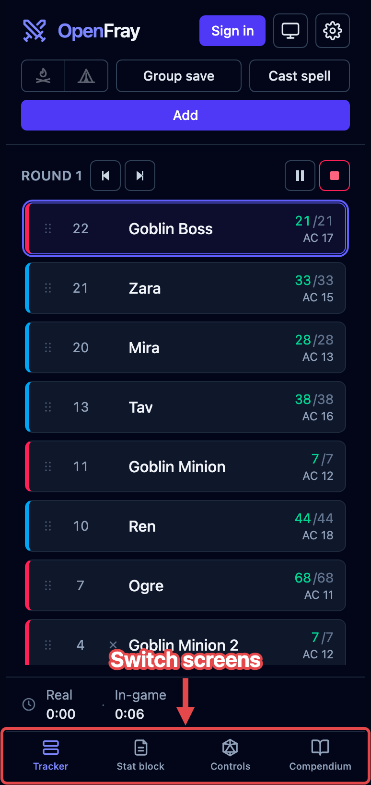
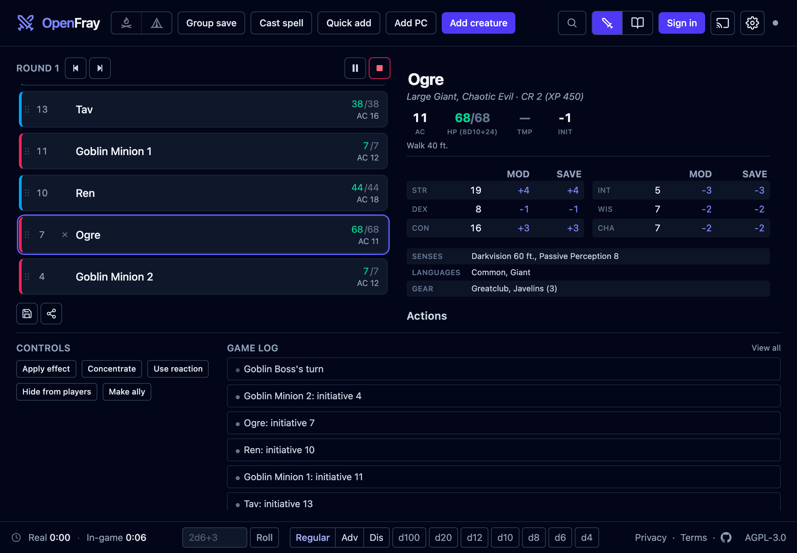
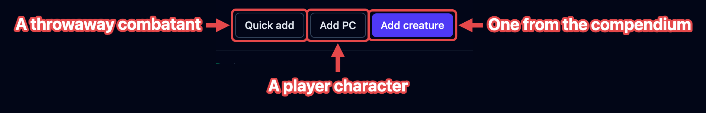
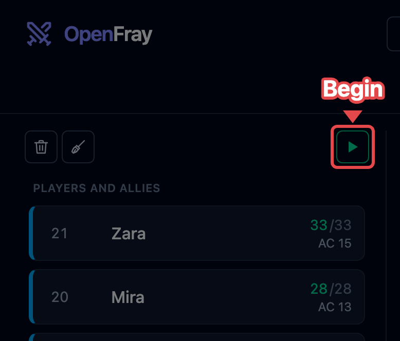
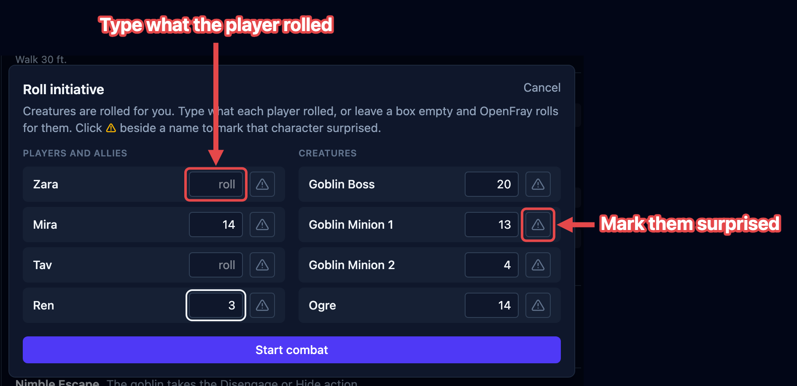

OpenFray is a combat console and initiative tracker for Dungeons and Dragons. It runs in
your web browser at [openfray.app/console](/console/). There's nothing to download and no
account needed. This page runs you through your first fight, start to finish. You can
[sign in](#saving-your-game) later if you want to save your game.

## The console at a glance

On a laptop, the console is one screen, split into three columns. Everything you use
during a fight is on it.

1. **The top bar.** Adding creatures and players, group saves, casting a spell, and
   rests, plus the switch between the console and the compendium. On its right: signing
   in, the **screen** (sharing a [player view](/docs/guides/player-view/)), and the
   **gear**, which opens a short menu: settings, light or dark, this handbook, and
   reporting a bug.
2. **The tracker.** Everyone in the fight, in the order they act, with hit points, armor
   class, and any conditions on them.
3. **The stat block.** Everything about the current or selected combatant: abilities,
   actions, reactions, and so on. Click an attack here to roll it. See
   [The stat block](/docs/reference/stat-block/).
4. **Controls and the log.** Buttons for the creature you've selected (apply an effect,
   concentrate, use a reaction) and below them a running list of what has happened.
5. **The bottom bar.** Dice you can roll by hand, how hard the fight looks before it
   starts, the fight's timers once it does, and, when you're signed in, which campaign
   you're running.

### On a phone or tablet

The console fits itself to the screen you open it on. The same five areas are always
there; smaller screens rearrange them. The buttons keep the same names everywhere, so
the steps in this handbook work on every screen. When a page says where a control is, it
describes the laptop layout.

On a phone, or a tablet held upright, the console shows one area at a time. A bar along
the bottom switches between **Tracker**, **Stat block**, **Controls**, and
**Compendium**. The dice sit at the top of the **Controls** screen, and the three add
buttons become one **Add** button.

On a smaller tablet held sideways, the tracker and the stat block sit side by side, with
the controls and the log in a band below them.

## Add your creatures and players

Add everyone before the fight starts. There are three buttons, one for each kind of
combatant:

1. **Add creature** — one from the built-in [compendium](/docs/reference/compendium/).
   Type a few letters of its name and click it. You get the whole creature: attacks,
   spells, everything. Add the same one twice and the second is named _Goblin 2_, so you
   can tell them apart.
2. **Add PC** — a player. Their name, armor class, hit points, and initiative bonus is
   all OpenFray needs; players roll their own dice.
3. **Quick add** — something you're inventing on the spot and won't use again. Just a
   name, hit points, and armor class.

Until the fight starts, players and foes sit in separate groups so you can see both
sides at a glance.

## Start the fight

Everyone's on the board, so start the fight. **Begin** is the ▶ button at the top of the
tracker, where the round number appears once you're going:

Before anything starts, OpenFray asks for everyone's initiative:

- Creatures are already rolled and filled in for you.
- Players are blank. Type what each player rolled, or leave it blank and OpenFray rolls
  for them.
- The ⚠ button beside a name marks that character **surprised**.

Click **Start combat** and you're in round 1. From there:

- **Next turn (›)** moves to the next creature; at the end of the list it starts the
  next round.
- **Previous turn (‹)** steps back one turn.
- Click anyone to see their stat block and act on them.
- **Pause** holds the fight so you can pick it up later. **Stop** ends it and takes you
  back to setup, keeping everyone on the board.

When the last foe goes down, OpenFray offers to end the fight and shows you a summary of
how it went.

## Saving your game

While you're signed in, OpenFray also:

- saves your fight and syncs it to your other devices;
- keeps a list of your players, so you don't type them in again;
- lets you set up [campaigns](/docs/guides/campaigns/) with your table's house rules;
- lets you build your own creatures and spells.

Saving happens in the background while you play; there is no save button. Nothing you
did before signing in is lost when you sign in.

:::note[Accounts are optional]
Signing in with an account is entirely optional and **free**, via Google or Discord.
Everything above works without an account.
:::

## Where to next

- [Run rounds & turns](/docs/guides/encounters/) — running the fight you just started.
- [Resolve an attack](/docs/guides/attacks/) — rolling a creature's attack and applying
  the damage.
- [Roll saving throws](/docs/guides/saves/) — one save or a whole group at once.
- [Apply & manage effects](/docs/guides/effects/) — tracking who's frightened, poisoned,
  blessed, and so on.
- [The tracker](/docs/reference/tracker/) — what each row shows, and changing hit
  points.
