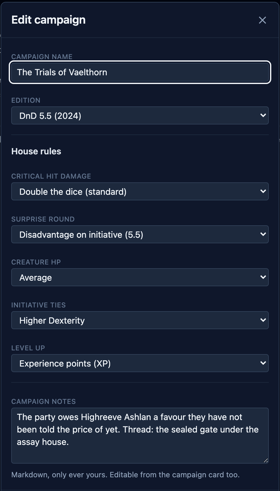
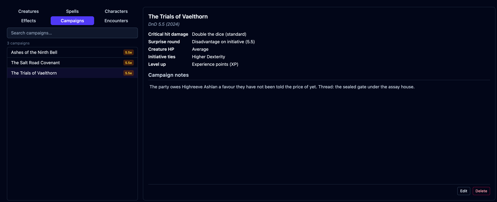
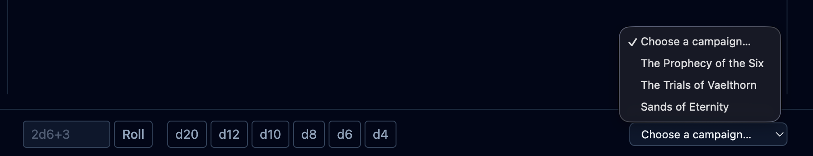

A **campaign** keeps one game together. It holds the rules your table uses, so you set
them once and they apply to every fight you run. This page covers creating a campaign,
the house rules, and picking which campaign you're running.

Without a campaign (including everyone not signed in), OpenFray uses the 2024-first
defaults: critical hits double the dice (standard), surprise is initiative with
disadvantage, creatures join with average hit points, initiative ties go to the higher
Dexterity, and the party levels by experience points.

:::note[Needs an account]
Creating and using a campaign requires signing in with a free Google or Discord account.
Without an account OpenFray uses the default rules.
:::

## Creating a campaign

Make and edit campaigns on the **Campaigns** tab of the
[compendium](/docs/reference/compendium/#campaigns):

1. Open the compendium with the **book** at the top of the screen, and pick the
   **Campaigns** tab.
2. Create a new campaign. The **New campaign** box asks for a name, an edition, the five
   house rules below, and any notes you want to keep on the game.
3. Pick the edition: **DnD 5.5 (2024)** or **DnD 5.0 (2014)**. It labels your games so
   you can tell them apart, and it decides which
   [Exhaustion rules](/docs/concepts/effects/#exhaustion) apply.
4. Set the house rules, and save.

Which creatures and spells you actually see is a separate choice, in
[Settings](/docs/reference/settings/#libraries), so it covers you whether or not you're
signed in.

## House rules

Each rule is a dropdown on the campaign form:

| Rule                    | What you can choose                                                                              |
| ----------------------- | ------------------------------------------------------------------------------------------------ |
| **Critical hit damage** | _Double the dice_ (standard); _Max normal dice + roll crit dice_ (brutal); or _Double the total_ |
| **Surprise round**      | _Initiative with disadvantage_ (DnD 5.5e); or _Skip the first turn_ (DnD 5e)                     |
| **Creature HP**         | _Average_, _Roll_, _Min_ or _Max_, calculated as each creature joins the fight                   |
| **Initiative ties**     | _Higher Dexterity_; _Players first_; or _Manual_, leaving the order to you                       |
| **Level up**            | _XP_, or _Milestone_                                                                             |

The crit and hit-point rules change the dice OpenFray rolls for creatures; it never
rolls a player's attack. The surprise and tie rules change the initiative order.

Once a campaign exists, its card lists every rule, so you can check what this table
plays without opening the form:

## Campaign notes

A campaign also carries **Campaign notes**: whatever you want to remember about this
game that isn't a house rule. The hooks you've planted, the threads still open, what the
party owes whom. Only you ever see them, and they never reach the shared
[player view](/docs/guides/player-view/).

There are two places to write them:

- **On the campaign form**, in the **Campaign notes** box under the house rules, while
  you're creating or editing a campaign.
- **On the campaign card**, without opening the form. Click the notes, type, and click
  away to save. There's no Save button. Press `Escape` to leave them as they were.

A campaign with none yet shows **Add campaign notes…** where they'd go. The notes take
Markdown, so headings, lists, and bold text all come out formatted.

Notes belong to the campaign. A saved character keeps its own **GM notes** separately,
on the [Characters tab](/docs/reference/compendium/#characters).

## Running a campaign

Pick the campaign you're running from the box at the bottom right of the console. That
choice is what applies its rules to the fight in front of you:

Selecting a campaign doesn't change the combatants already in the tracker. Add a
creature again if its hit points should follow the new rule.

## Leveling up: experience or milestone

The **Level up** rule changes what the fight reports:

- **XP** — the usual way. The experience points each creature awards show on stat
  blocks and in the [end-of-fight summary](/docs/guides/recap/), as a total and split
  for each player on the board (allies excluded).
- **Milestone** — you level the party up at story moments. Pick this and OpenFray hides
  experience during a fight and in the summary.

The [compendium's creature list](/docs/reference/compendium/#creatures) always shows
experience, whichever you pick. It is a reference either way.
