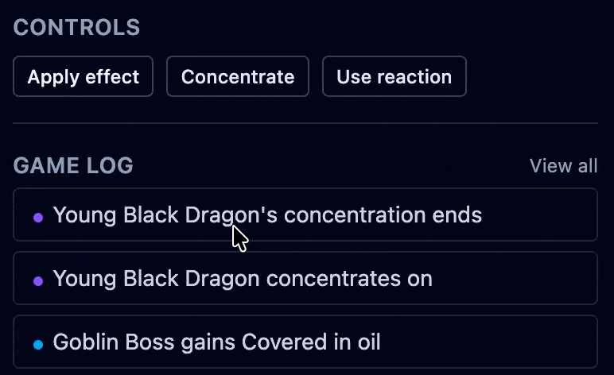
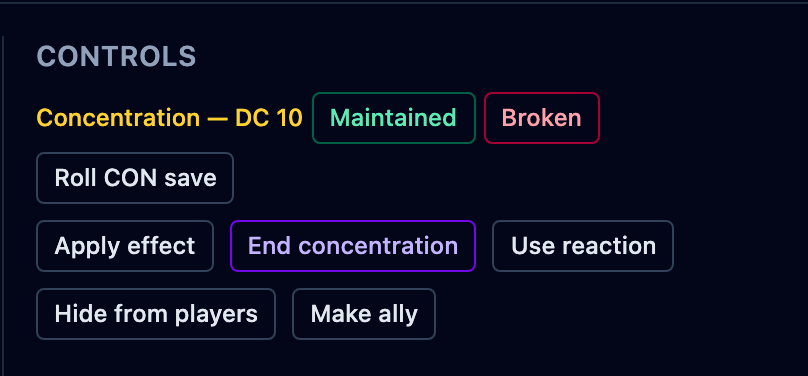

Some spells last only while their caster keeps **concentration**, and hold it until the
caster drops it, loses it to damage, or lets it run out. OpenFray tracks who is
concentrating on what, and clears the spell's effects everywhere the moment
concentration ends. This page covers starting it, ending it, and the check after damage.

## Mark a creature as concentrating

1. Select the creature and click **Concentrate** in the controls beside its stat block.
2. Type the spell's name, and pick how long it lasts if you want the timer. Both are
   optional.
3. Click **Set**. The creature's row shows a **C** badge while it concentrates.

Casting a concentration spell from [Cast spell](/docs/guides/spells/), or from a
creature's stat block, starts this for you with the timer already counting, as soon as
the spell lands on someone. A spell every target shrugs off leaves nothing to hold on
to, so nobody is marked as concentrating.

## End concentration

Concentration is what keeps the spell going, so **ending it removes that spell's effects
from everyone at once**. Break the caster's concentration on _Bless_ and all three
blessed allies lose it together; you don't clear each one by hand.

To end it yourself, select the creature and click **End concentration**, where
**Concentrate** was. Concentration also drops on its own when its timer runs out.

## The check after damage

When a concentrating creature takes damage, it must make a Constitution save to hold
on. OpenFray works out the DC (10, or half the damage taken, whichever is higher) and
prompts you in the controls beside the stat block:

- **Maintained** — the save succeeded; concentration holds.
- **Broken** — the save failed; concentration ends, and the spell's effects clear.
- **Roll CON save** — for a creature, OpenFray rolls the save for you. A player rolls
  their own, and you tap **Maintained** or **Broken**.

Breaking concentration this way clears the spell's effects the same as ending it by
hand.

