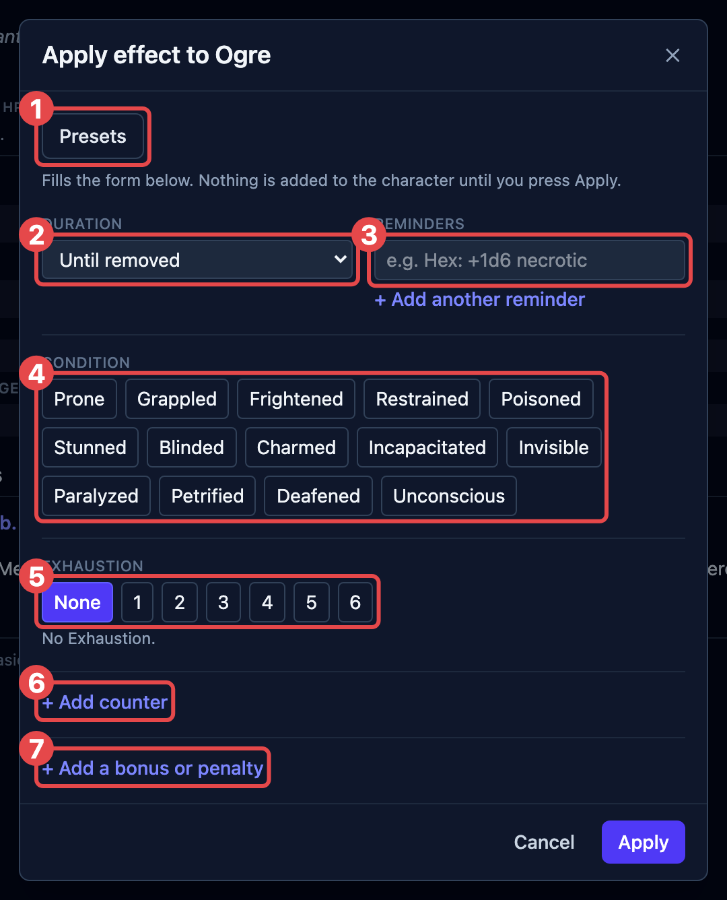
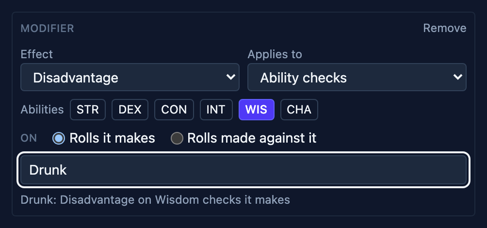
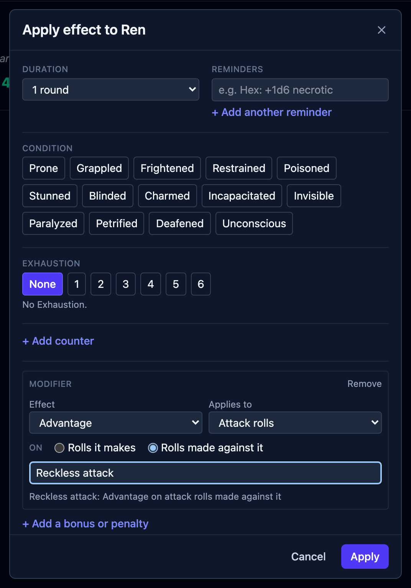
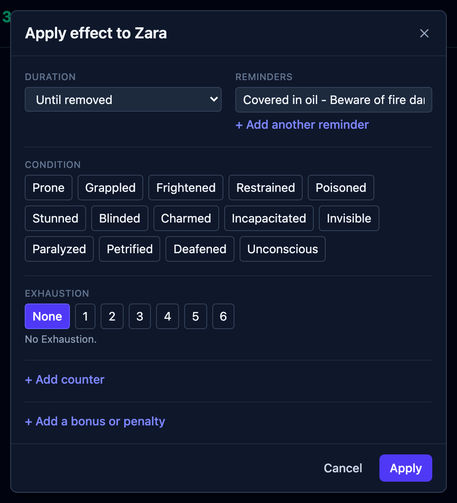
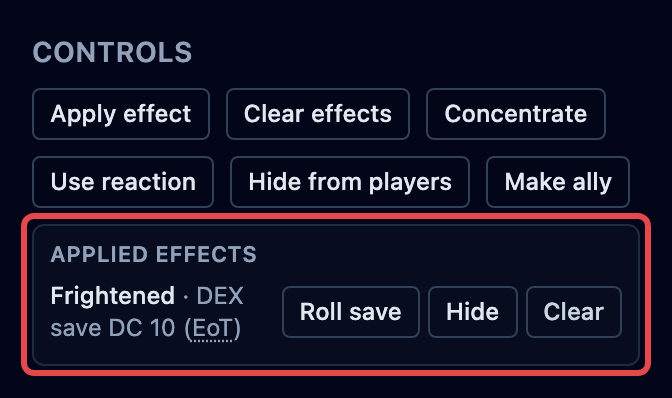
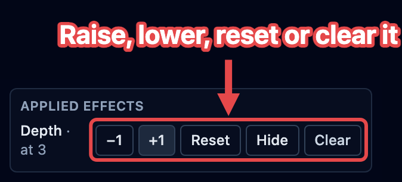

Everything that lands on a creature during a fight is applied from one box, and managed
from one list. This page covers both, plus presets, Exhaustion, and counters. What an
effect is, and how long each kind lasts, is explained in
[How effects work](/docs/concepts/effects/).

## Apply an effect

Click the creature in the tracker, then click **Apply effect** in the controls beside
its stat block. The box stages everything you pick; nothing lands on the creature until
you press **Apply**, so you can build the whole thing and change your mind on the way.

The numbered parts match the picture. Use the ones you need, in any order:

1. **Start from a preset, if one fits.** **Presets**, at the top of the box, searches
   the ready-made bundles, both yours and the ones your
   [libraries](/docs/reference/settings/#libraries) ship. Picking one fills the form
   below, replacing whatever was staged, and you can adjust any part before applying.
   The row appears once there are presets to offer. See [Presets](#presets).
2. **Set how long it lasts.** The duration applies to everything staged in the box:

   | Choice                      | Use it for                                                                                                                                                 |
   | --------------------------- | ---------------------------------------------------------------------------------------------------------------------------------------------------------- |
   | **Until removed**           | you'll clear it yourself when the story says so                                                                                                            |
   | **This turn / next attack** | something used up by the next roll (Vicious Mockery)                                                                                                       |
   | **Save ends**               | something the creature can shake off. It then asks which save, the number to beat, and whether it's rolled at the start or the end of that creature's turn |
   | **1 round** … **24 hours**  | anything with a stated duration, such as a spell or a potion                                                                                               |
   | **Custom…**                 | any other length, typed as a number of rounds, minutes, hours, or days                                                                                     |

3. **Type a reminder.** A short note OpenFray shows on the creature's row. It reminds
   you; you decide what it does. **+ Add another reminder** stages a second note.
4. **Toggle conditions.** The ones already on the creature are highlighted, and tapping
   one again takes it off.
5. **Set an Exhaustion level.** Exhaustion is a number from 1 to 6. Click the level, and
   the line below spells out what it does before you apply it. **None** takes the
   condition off. See [Set an Exhaustion level](#set-an-exhaustion-level).
6. **Add a counter.** Click **+ Add counter** and name it. Tick **Hidden from players**
   to keep its number off the shared [player view](/docs/guides/player-view/). See
   [Add a counter](#add-a-counter).
7. **Add a bonus or penalty.** Click **+ Add a bonus or penalty** and pick the
   **Effect** (Advantage, Disadvantage, or a number), what it **applies to**, and whose
   rolls: the creature's own, or rolls made against it. It can apply to a kind of roll
   (attack rolls, saving throws, ability checks, or everything) or to one of the
   creature's numbers: armor class, Speed, or the hit point maximum. A modifier on
   saving throws or ability checks can be narrowed to particular abilities, so
   "Disadvantage on Wisdom checks" reaches only those. Give it a label, like Bless or
   Reckless, so you recognize it on the board later. OpenFray spells out what you've
   built in plain English.

A Speed amount can be a number (`-10`), or `half`, `zero`, or `double`.

With two or more parts staged, **Apply as one** offers a name: _Drunk_, _Cursed_. Named,
everything above lands as one [bundle](/docs/concepts/effects/#bundles) that clears
together; left blank, each part gets its own badge.

Finish with **Apply**, or click **Save as preset** first to keep the bundle for next
time.

## Two examples

### Reckless Attack

The barbarian's player announces it. There's no spell to cast and nothing on any stat
block; for the rest of the round, attacks against them have advantage.

1. Click the player's character, then **Apply effect**.
2. Set **Duration** to **1 round**, so it clears itself when their turn comes round
   again.
3. Click **+ Add a bonus or penalty**.
4. Set the **Effect** to **Advantage**, **Applies to** to **Attack rolls**, and **On**
   to **Rolls made against it**.
5. Set the label to **Reckless attack**, so the badge on their row says why.
6. Click **Apply**.

Now when a creature swings at them, OpenFray rolls with advantage on its own, shows both
dice, and names _Reckless attack_ as the reason.

### Something you just made up

A creature throws a flask of oil on a player, and now they're covered in oil. There's no
condition for that and no spell involved; you just don't want to forget it two rounds
from now.

1. Click the player, then **Apply effect**.
2. Set **Duration** to **Until removed**, because it ends when the story says so.
3. Type the note in **Reminder** and press **Apply**.

It becomes a badge on their row like any other effect. OpenFray shows the reminder until
you clear it, and you decide what it means.

## The Applied effects list

The **Applied effects** list, in the controls beside the stat block, holds every effect
on the selected creature with its buttons. A bundle appears under its own name with its
parts listed beneath it:

- **Clear** removes an effect. Inside a bundle it removes just that part; **Clear all**
  on the bundle's own line removes the lot.
- **Roll save** rolls the save of an effect that ends on one; the line shows the ability
  and the number needed. For a player, use it to record their roll, or just **Clear**
  the effect when they pass.
- **Hide** keeps an effect off the shared [player view](/docs/guides/player-view/). A
  hidden effect is tagged **Hidden**, and clicking again shows it. A bundle reaches your
  players as one badge, so **Hide** sits on the bundle's line and covers everything
  inside it.
- **Clear effects**, at the bottom, removes all the applied effects at once.

Casting a spell can put effects on the board too, already bundled under the spell's
name. See [Cast a spell](/docs/guides/spells/).

## Presets

A preset is a bundle you apply more than once: _Drunk_, a disease stage, a house rule.
Open **Apply effect** and click **Presets** to search them. Picking one fills the form,
and nothing lands until you press **Apply**, so you can adjust it first.

Presets come from two places:

- **Your own.** Stage the parts once, then click **Save as preset** and name it. It's
  kept in your library and offered in every fight.
- **A library's.** Turning a library on in
  [Settings](/docs/reference/settings/#libraries) adds the presets it ships:
  _Brood & Bloom_ carries its disease stages and brood counters, and _On Strong Waters
  and Potent Simples_ carries Intoxication, Craving, and the degrees of addiction.

Read any preset in full on the compendium's **Effects** tab. See
[The compendium](/docs/reference/compendium/#effects).

:::note[Needs an account]
Saving your own presets requires signing in with a free Google or Discord account. A
library's presets work for everyone who has the library turned on.
:::

## Set an Exhaustion level

Exhaustion is a level from 1 to 6; what each level does is explained in
[How effects work](/docs/concepts/effects/#exhaustion). To set it:

1. Click the creature, then **Apply effect**.
2. Under **Exhaustion**, click the level, or **None** to take it off.
3. Read the line below the levels. It says what that level does before you commit.
4. Click **Apply**.

The creature's row shows one badge reading **Exhaustion 3**, and the **Applied effects**
list shows what the level landed. Its buttons sit on the badge's header line:

| Button        | What it does                                               |
| ------------- | ---------------------------------------------------------- |
| **+1**        | Raises the level by one. It stops at 6.                    |
| **−1**        | Lowers it by one. At 0 the condition ends.                 |
| **Clear all** | Takes Exhaustion off entirely, with everything it applied. |

The parts underneath have no buttons of their own. They're what the level means, so
changing one alone would only put it out of step with the number.

### From an attack or a save

Plenty of creatures cost a failed save a level: a troll's missing limbs, a night in the
cold. You don't have to open **Apply effect** for those. The **+1 Exhaustion** chip sits
with the condition chips in the [attack](/docs/guides/attacks/) and
[save](/docs/guides/saves/) boxes, and in [Group save](/docs/guides/saves/#group-saves).
It raises each affected creature from the level it already carries, so a group of six
all move up by one whatever they were on.

The chip ignores the duration beside the condition chips. A level lasts until you lower
it.

### Exhaustion in a preset

Exhaustion is cumulative, so a [preset](#presets) carrying it **adds levels** instead of
setting one. Save a preset while a level change is staged and it keeps that change:
stage 3 on a character already at 1 and the preset is worth two levels. Apply it to
someone at 0 and they end at 2; apply it to someone at 4 and they end at 6.

The preset's card on the compendium's **Effects** tab says which, as _Gains 2 levels_. A
preset can relieve Exhaustion the same way: lower the level before you save it, and the
card reads _Removes 1 level_.

## Add a counter

A counter holds a number you raise and lower by hand; see
[How effects work](/docs/concepts/effects/#counters). To add one:

1. Click the creature, then **Apply effect**.
2. Click **+ Add counter**.
3. Type its name, something like `Depth` or `Corruption`, and tick
   **Hidden from players** if the table shouldn't read it.
4. Click **Apply**.

It starts at 0 and shows on the creature's row as a badge with its number in it. In the
**Applied effects** list, it gets buttons of its own:

| Button    | What it does                                        |
| --------- | --------------------------------------------------- |
| **+1**    | Raises the number by one.                           |
| **−1**    | Lowers it by one. It never goes below 0.            |
| **Reset** | Puts it back to 0, and leaves the counter on.       |
| **Clear** | Removes the counter, the way it removes any effect. |

