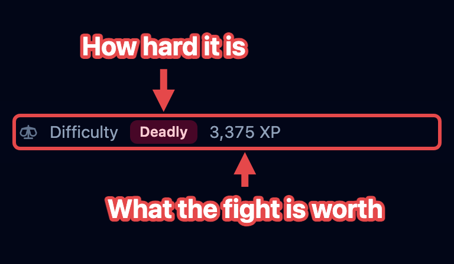
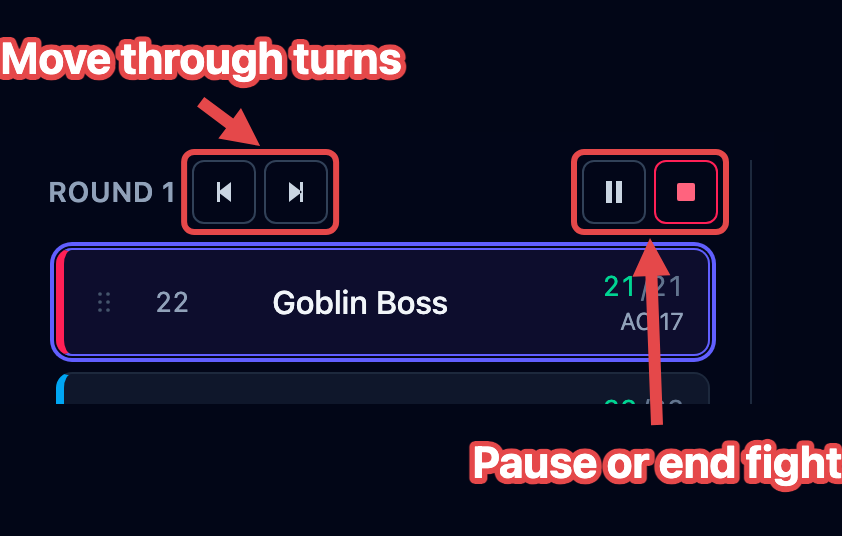
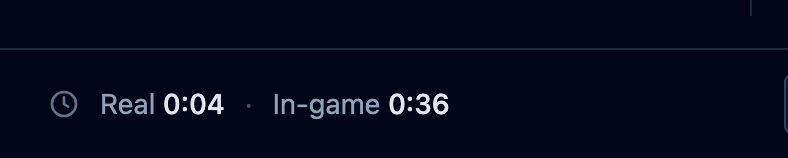
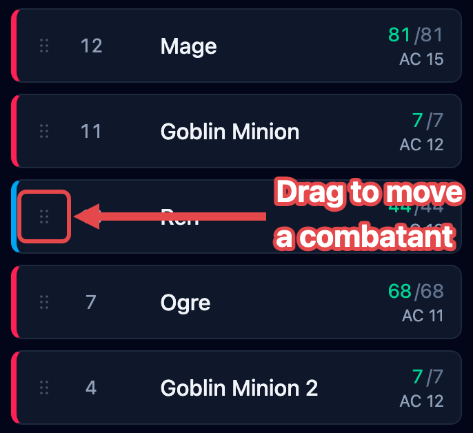
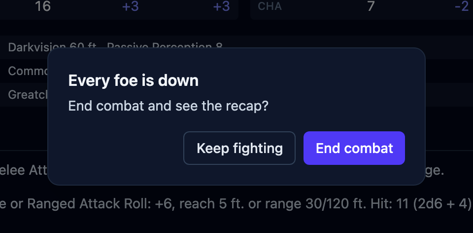

An **encounter** is the fight you're running: everyone in it, the initiative order, and
which round you're on. It lives in the [tracker](/docs/reference/tracker/). This page
covers starting the fight, moving through turns, fixing the order, and ending it.

## Setting the order

Add everyone before the fight starts (see
[Getting started](/docs/getting-started/#add-your-creatures-and-players)). Until you
begin, players and foes sit in separate groups so you can see both sides. Then:

1. Click **Begin**, the ▶ at the top of the tracker. The **Roll initiative** box opens.
2. Check the creatures' rolls. OpenFray has already rolled and filled them in.
3. Type what each player rolled, or leave a player blank and OpenFray rolls for them.
4. Click the ⚠ beside a name to mark that character **surprised**. What surprise does
   depends on your campaign's [surprise rule](/docs/guides/campaigns/#house-rules).
5. Click **Start combat**. You're in round 1, at the top of the list.

## How hard the fight looks

While you're filling the board, the left of the footer rates the fight in front of you:
**Trivial**, **Easy**, **Medium**, **Hard**, or **Deadly**, with the experience points it
adds up to. It changes every time you add or remove someone, so you can drop in one more
foe and watch it move.

The rating is an estimate, built from four rules:

- **Your players set the bar.** OpenFray doesn't know anyone's level. It works it out
  from their hit points, and from Constitution when the character has it recorded. Give
  a saved [character](/docs/concepts/combatants/#players) its ability scores and the
  estimate gets closer.
- **A crowd counts extra.** Six foes are harder than one foe worth the same experience,
  so the total is scaled up for a crowd, and again for a party of one or two.
- **A quick add is guessed at.** Something you invented on the spot carries no
  experience value, so OpenFray sizes it up from its hit points and armor class. It's a
  rough figure.
- **The dead don't count.** Foes left on the board from the last fight are ignored.

Once the fight starts, the [clocks](#the-clocks) take that spot. The rating is kept and
shown again in the [end-of-fight summary](/docs/guides/recap/).

## Rounds and turns

The creature whose turn it is glows in the tracker, and its stat block fills the middle
of the screen. The buttons beside the round number move the fight along.

- **Next turn (›)** moves to the next creature; at the end of the list it starts the
  next round.
- **Previous turn (‹)** steps back one turn.
- **Pause** holds the fight while the session stops for a break or a talk. The turn
  marker disappears so nobody is "up", and the clocks stop counting. Press it again to
  carry on where you left off.
- **Stop** ends the fight. Everyone stays on the board with their hit points, effects,
  and conditions intact; the round counter resets and **Begin** comes back. Nothing is
  lost, so stopping by mistake is safe.

:::caution[Previous turn doesn't undo]
**Previous turn** moves the marker back and nothing else. Timers that counted down, a
used reaction, or lost concentration all stay as they are. Use it when you clicked ahead
by mistake, and put anything else right by hand.
:::

### What Next turn does

Clicking **Next turn** does more than move the marker. Each time, OpenFray:

- counts down effects that last a set number of rounds, and removes the ones that run
  out;
- gives the creature back its reaction, and refreshes its legendary actions;
- clears effects that last "until my next turn" as their owner starts to act;
- counts down concentration and drops it when it runs out;
- makes a creature's [saves to shake off an effect](/docs/concepts/effects/#effects-a-saving-throw-ends)
  at the right moment in its turn;
- rolls to see whether a used-up recharge ability is available again, like a dragon's
  breath.

OpenFray follows whose turn it is by the creature itself, so adding, removing, or
dragging creatures around never loses the turn.

### The clocks

Two clocks run in the footer while you fight: **Real**, the time you've actually spent
(pauses don't count), and **In-game**, six seconds per round. Use the in-game clock to
tell a player how long a timed spell has left.

## Rearranging the order

The order needs a change when someone holds their action, or when you typed a number
wrong. Once the fight is running, every living row shows a **drag handle**: the six
small dots on the far left of the row, before the initiative number.

Drag that handle up or down to move the combatant. Its initiative changes to fit its new
spot, and nobody else's number moves. Combatants that are down or dead stay in the list,
grayed out and skipped, so the order holds steady if they come back.

## Ending the fight

When the last foe is defeated, OpenFray asks once whether the fight is over.

- Click **Keep fighting** to keep the fight active, for a second wave of foes or a
  player still rolling death saves.
- Click **End combat** to stop the fight and see its summary: the outcome, experience,
  timings, and standout hits. See [End the fight](/docs/guides/recap/).

## Where to next

- [Resolve an attack](/docs/guides/attacks/) — a creature's attack, from roll to damage.
- [Roll saving throws](/docs/guides/saves/) — one save or a whole group at once.
- [Apply & manage effects](/docs/guides/effects/) — putting conditions and bonuses on
  the board.
- [Rest & clear the board](/docs/guides/rests/) — between fights.
