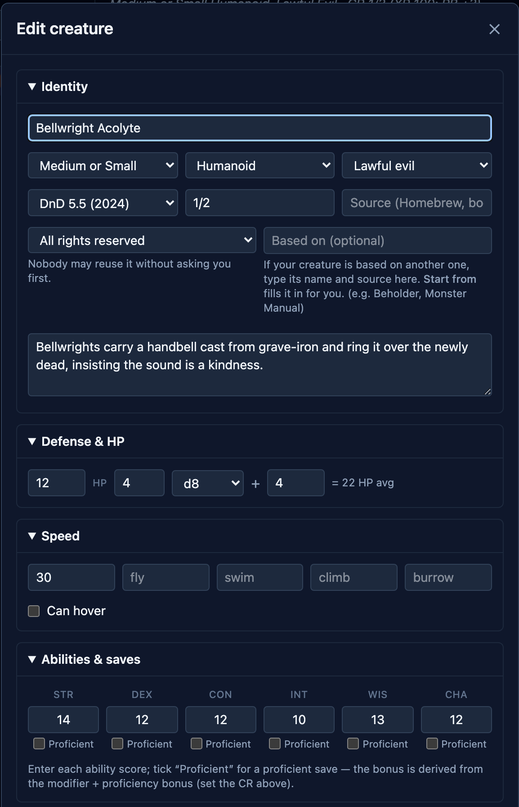
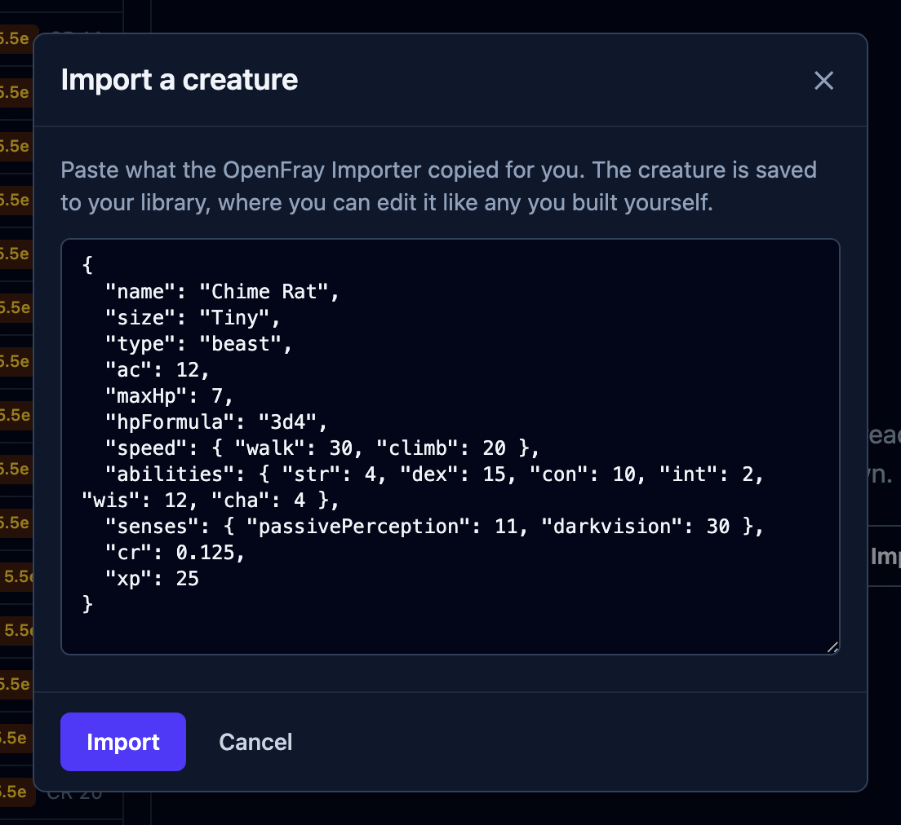
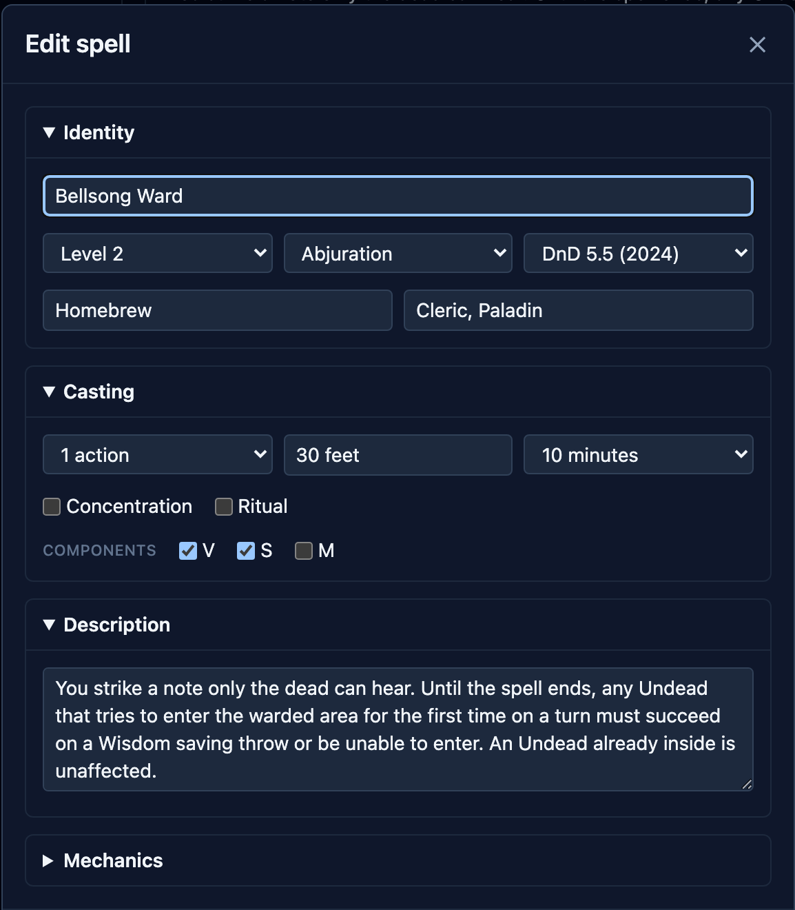

The built-in books don't have everything. Some famous creatures aren't in the Core Rules
at all, and your table has its own creations. OpenFray's homebrew editors let you build
your own creatures and spells, kept in your library next to the built-in ones and ready
to drop into any fight. Both editors live in the
[compendium](/docs/reference/compendium/): open the **Creatures** or **Spells** tab and
use the create button.

:::note[Needs an account]
Homebrew creations are stored in your account. Creating them requires signing in with a
free Google or Discord account.
:::

## Starting from one that exists

Most homebrew is a small change to something in the books: a goblin with a crossbow, a
fireball that deals cold damage. Both editors open with **Start from…** above the name,
so you don't type the rest of the stat block again.

1. Click **Start from…** at the top of the form. It searches everything you can use: the
   [libraries you've turned on](/docs/reference/settings/#libraries) and your own
   creations, each badged with where it came from.
2. Click the one you want. Every field fills in, and every field stays editable.
3. Type the **name**. The name is the one thing that isn't copied, because what you're
   making is a new entry of its own. The **Source** is also left for you to fill in.

What you save gets its own entry, badged **Custom**, and editing it later never touches
the one you started from.

**Start from…** appears when you're creating. It isn't there when you edit something you
already saved, because the form is already that creature.

## Creating a homebrew creature

The form is a whole stat block, broken into collapsible sections you can work through in
any order: **Identity**, **Defense & HP**, **Speed**, **Abilities & saves**, then
skills, senses, traits, actions, reactions, legendary actions, and spellcasting.

You enter the creature's stats, and OpenFray does the math from them:

- Give it a **challenge rating**, in Identity, and OpenFray knows its proficiency bonus.
  Everything below depends on it, so set it early.
- In **Defense & HP**, give the **hit dice**: how many, which die, and any modifier. The
  average appears beside them (_"= 17 HP avg"_).
- In **Abilities & saves**, type the six scores and tick **Proficient** on the saves
  it's good at. The bonus is the modifier plus the proficiency bonus, calculated for
  you.
- Skills work the same way. Tick proficient, and tick expertise where it applies.
- For an attack, pick **which ability** it swings with. The to-hit is that ability's
  modifier plus proficiency, and the modifier is baked into the damage the way printed
  stat blocks do it.
- For spellcasting, pick the **ability**; the save DC and spell attack bonus follow.

Every derived number updates as you type, so you can check them as you go. If one looks
wrong, fix the ability score or the challenge rating behind it, and the total follows.

### Importing instead of typing

If the creature already exists on D&D&nbsp;Beyond, don't retype it. The
[importer](/docs/guides/importer/) turns that page into an OpenFray creature. Paste what
it gives you into **Import a creature**, on the Creatures tab:

What lands in your library is an ordinary custom creature: editable, yours, and no
different from one you built by hand.

:::tip[Import your existing homebrew creatures]
If you already built homebrew creatures on D&D Beyond, the importer brings them into
OpenFray without retyping.
:::

## Creating a homebrew spell

The spell form covers the card, in the same collapsible sections: **Identity** (name,
level, school, rules version), **Casting** (time, range, duration, concentration,
ritual, components), **Description**, and **Mechanics**, where you say whether the spell
resolves as _nothing_, a _spell attack_, or a _saving throw_. Leave Mechanics empty and
you get a utility spell: OpenFray shows the card and lets you adjudicate.

**Casting at higher levels** usually follows a pattern, so you describe the pattern
once: give the extra damage per slot above the spell's base level (or, for a cantrip,
per tier as the caster levels up), and OpenFray expands that into the actual damage at
every level, showing you the result as you type. For spells that don't follow a neat
pattern, switch to **Edit each level** and set them by hand.

## Where the homebrew creations live

Your creatures and spells:

- appear in the compendium beside the built-in ones, badged **Custom**;
- show up in the **Add creature** and **Cast spell** pickers;
- belong to the **Homebrew creations** library, on by default in
  [Settings](/docs/reference/settings/#libraries), so you can shelve them all at once;
- can be edited or deleted later from the bottom of their own card.

Editing one doesn't change a fight already in progress. A creature you added to the
tracker is a copy, taken at the moment you added it, so add it again if you want the
changes on the board.
