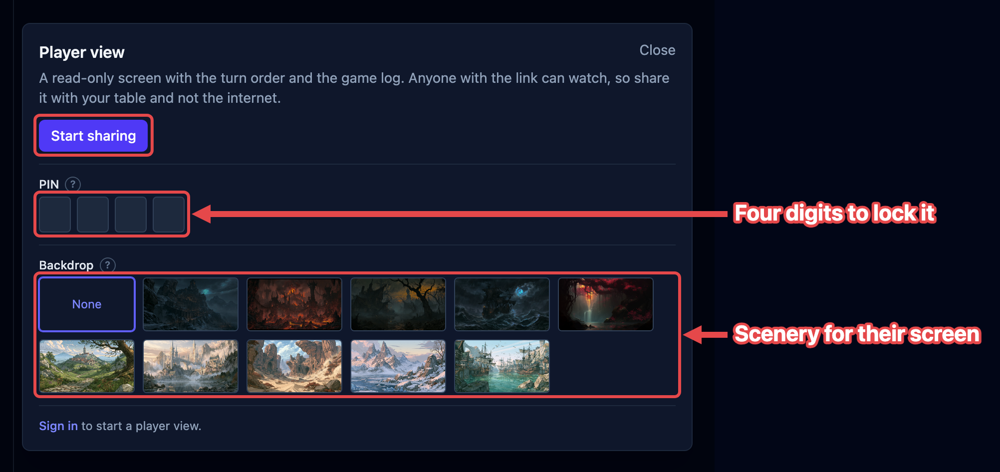

The **player view** is a read-only screen your players open on their own devices. It
shows the turn order and the game log, and nothing else. It is live, and it is for your
own table: handing an encounter to another Game Master is
[publishing](/docs/guides/publishing/), which is a different link. You decide when it's on and how
much of a creature it gives away. This page covers sharing it, what your players see,
and what stays with you.

It works without an account. Signing in lets you give the link a name you can remember.

## Sharing the fight

The **cast** button sits in the top bar, between your account and the gear. It's the
one that looks like a screen with signal waves coming off it.

1. Click the **cast** button. The **Player view** box opens.
2. Click **Start sharing**. A green dot appears on the button while sharing is on, and
   the box grows a **Link** section.
3. Click the **copy** button (two sheets) beside the link, and send the link to your
   players however you normally talk to them.
4. To see what your table sees, click the **open** button (an arrow leaving a box). The
   player view opens in a new tab.
5. When you're done, open the box again and click **Stop sharing**.

Your players' screens fill in as soon as you start. If someone opens the link first, it
says it's waiting and then fills in on its own. Nobody has to reload.

Reloading the console doesn't interrupt them either: sharing picks up again on its own,
and only stops when you press **Stop sharing** or close the tab.

Everything else in the box (the PIN, the backdrop, the link's name) can be changed
mid-fight, and reaches the table straight away.

:::caution[Anyone with the link can watch]
Without a PIN the link is the only thing protecting the view, so give it to your table
and keep it off the public internet. Nobody can change anything through it: the player
view has no buttons.
:::

## Lock it with a PIN

If you'd rather the link wasn't enough on its own, set a four-digit **PIN**. Your players
type it once, on their own device, before the board shows.

1. Click the **cast** button.
2. Under **PIN**, type four digits into the boxes. The fourth digit sets it, and the box
   says so.
3. Tell your table the four digits.

Anyone opening the link now gets **This view is locked** and four boxes of their own. The
right four open the board in a moment; the wrong four are told so and can try again.

**Remove**, beside the boxes, lifts the lock and leaves the link open. Clearing every box
does the same.

The lock is real, not a curtain. With a PIN set, the board travels down a route worked
out from the link *and* the PIN together, so somebody who has the link and not the digits
has nowhere to read the fight from. Nothing is being hidden from a page they already
have.

The PIN is kept in the browser you set it in, beside the link itself, so it survives a
reload and lasts until you change it.

## Put a backdrop behind it

A **backdrop** is a piece of scenery behind your players' screen. Under **Backdrop** in
the same box, pick one of the tiles, or **None** for the plain screen. It changes on
their devices as you click, so you can move the scene from the harbor to the marsh
between rounds.

Ten come bundled, and nothing else can be used: the art ships with OpenFray, so your
players' browsers never fetch a picture from anywhere else.

- **Night and dusk** — Mountain fortress, Hell fortress, Marsh, Sea, Magical forest.
- **Daylight** — Valley road, Elven city, Desert ruins, Frozen lake, Morning harbor.

Each piece was treated for one of the two moods, and it brings that mood with it: a
daylight backdrop turns your players' screen light, a night one turns it dark. While a
backdrop is showing, their light-and-dark switch stands down rather than fight it, and
picking **None** hands them their own choice back untouched.

Like the PIN, the backdrop belongs to the browser you set it in, not to a campaign or an
account. It needs neither.

## What your players see

Their screen has two side-by-side columns, which scroll separately so a long fight's log
never pushes the turn order out of sight. On a phone they stack, log underneath.

- **The turn order** — everyone in the fight, in initiative order, with their conditions
  and effects, who's up, and which round you're on.
- **The game log** — the running record of what happened.
- **The clocks** — how long the fight has taken, and how long it has run in the game.

The top of their screen carries the OpenFray wordmark and their own light-and-dark
switch. It can carry your campaign's name and your own, too. Both are off until you turn
them on, in the settings covered below.

Player characters always show in full: hit points, armor class, conditions, and death
saves. Your table wrote those numbers down themselves. Anyone fighting alongside them
shows in full too: a summoned wolf, a hired guard, a creature you've made an ally (see
[Allies](/docs/concepts/combatants/#allies)).

How much of a **creature** they see is your call, in the settings covered below.

### When a creature appears

Your players see the creatures when the fight starts, and not while you're setting it
up. Until you press **Begin**, their screen shows the party and nothing else, so lining
up six ogres gives nothing away.

You can overrule that for any creature, either way:

1. Click the creature in the tracker.
2. In the controls beside its stat block, click **Hide from players** to hold it back,
   or **Show to players** to put it on their screen. The button always names what the
   click does, so it reads **Show to players** before the fight, when no creature is on
   their screen yet.

A creature you hold back is tagged **Hidden** on your own tracker, and anything it does
stays out of your players' log. A creature merely waiting for the fight to start isn't
tagged; it appears on its own when you press **Begin**.

A creature that arrives mid-fight follows your **Creatures arriving mid-encounter**
setting, so reinforcements can be held back by default and revealed when the party sees
them.

When the fight ends, every creature leaves your players' screen again, and anything you
showed or hid during it goes back to normal. The next **Begin** puts them all back, so
you never reveal the same creature twice.

### What lands in their log

Everything that happens on the board, minus the dice a creature rolled:

| They see                                               | They don't                    |
| ------------------------------------------------------ | ----------------------------- |
| A creature attacking, and whether it hit or missed     | The dice, or its attack bonus |
| What a roll came to, and the damage it dealt           | The dice that got there       |
| Whether a creature saved or failed                     | Its save total, or its bonus  |
| How much damage a creature took, or was healed         | How many hit points it has    |
| Conditions and effects landing and clearing, on anyone | —                             |
| Concentration starting and breaking                    | —                             |
| Spells being cast, by name                             | —                             |
| Turns, rounds, knockouts, deaths, and rests            | —                             |

A roll's total is safe to show, because the dice and bonuses behind it stay unknown. A
**saving throw** is the exception and shows no number at all: set against a difficulty
class your table can work out, a save total would give the creature's bonus away, so
their screen says only saved or failed.

Damage always reaches them, whichever hit-point setting you use. The party watched the
hit land, and the number they lost is theirs to know. What stays with you is how many
hit points the creature had to begin with.

:::note[Legendary Resistance is never spoiled]
A creature that fails a save and then spends Legendary Resistance shows your players
**Saved**, and nothing before it. The outcome isn't shared until you've settled it, so
the table never reads a "Failed" that you then take back.
:::

Two things never reach the player view, whatever you choose:

- **Creature stat blocks** — abilities, attacks, traits, and spells.
- **Recharge rolls** — whether a dragon got its breath weapon back.

### When the fight ends

Your players see the same summary you do, for as long as you leave it open: the outcome,
the experience earned, how long it took, and the standout hits. Their log clears at the
same moment, ready for the next fight. Both are settings, covered next.

## Choosing what they see

Click the **gear** at the top right, choose **Settings**, then the **Player view** tab.
Every choice applies to every fight, and reaches your players' screens straight away,
mid-fight included. The full list of choices is in
[Settings & appearance](/docs/reference/settings/#player-view). Four are worth
explaining:

- **Creature hit points → In words** shows a creature as **Healthy**, **Hurt**,
  **Bloodied**, or **Critical**, without the number. Your players can tell the fight is
  going their way without counting hit points down to the last one.
- **Creature rolls → Hidden** takes the total off a creature's attacks, saves, and
  checks. What happened stays: whether it hit or saved, and the damage it dealt.
- **Creature conditions → Hidden** takes the badges off a creature's row, and the lines
  about conditions landing and clearing out of their log. Your players' own characters
  keep theirs.
- **Game log → This encounter only** starts their log fresh each time you press
  **Begin** and clears it when the fight ends. Yours keeps everything either way.
- **Campaign name** and **Game Master name → Shown** head their screen with the
  campaign you're running and **Run by** your profile name. Both start off: what the
  game is called is yours to announce, not the link's. The second one needs an account,
  because an anonymous link has no name to send.

## Naming the link

Without an account you get a link with a jumble of letters in it. It's yours, it stays
the same, and it's kept in the browser you're using.

Sign in and you can name it instead. Under **Link**, the part nobody edits is written
out as plain text and the end of the link sits in a box after it, so you're editing the
link itself rather than filling in a field about it:

1. Click the **cast** button.
2. Type over the end of the **Link**, something like `tuesday-game`.
3. Click **Save**. The button appears once what you've typed differs from the link you're
   on.

Letters, numbers, and hyphens only; anything else simply doesn't land as you type, so the
count of what you've typed is always the truth. Names are first come, first served: if
another Game Master has already taken one, OpenFray says so and your current link keeps
working, so nothing breaks mid-session.

A named link follows your account, so it's the same on your laptop and your tablet, and
it's still the same next week.

:::caution[Signing out gives the name back]
The name belongs to the account, so signing out stops the share and mints a fresh
anonymous link. A link your table is holding from a signed-in session stops working at
that moment. Sign back in and the name is yours again, but hand out the new link, or
sign in again first, before the next session.
:::

## What isn't saved

Nothing about the shared view is stored on a server. The board is passed to your
players' screens as it changes and kept nowhere, so:

- when you stop sharing, or close the tab, their screens say the Game Master has stepped
  away;
- there's no history to scroll back through after the session;
- two Game Masters sharing at the same time never see each other's fights.

## Where to next

- [Settings & appearance](/docs/reference/settings/#player-view) — every player-view
  choice and its default.
- [The game log](/docs/reference/game-log/) — what gets logged, and how to review it.
- [End the fight](/docs/guides/recap/) — the summary your players see with you.
- [The tracker](/docs/reference/tracker/) — the same order, from your side.
