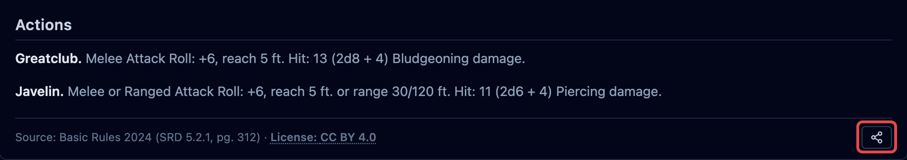

**Publishing** puts a single creature at a link anyone can open. They read its stat block
in their browser, and copy it into their own library with one click. It's how you send a
homebrew creature to the person who asked for it, without handing over the whole
encounter it lives in. That's a different task, covered in
[Publish an encounter](/docs/guides/publishing/), which this page follows closely.

This is not the [player view](/docs/guides/player-view/), which is a live screen for your
own table during a fight. Publishing needs an account, the same way publishing an
encounter does.

## Publishing a creature

Open the creature in the compendium and click the **share** button on its stat block.

The dialog that opens is the one [Publish an encounter](/docs/guides/publishing/#publishing-an-encounter)
walks through, minus two fields an encounter needs and a creature already has: there's no
**Name** (the creature's own name is used) and no license to choose. The creature carries
its own, set when you built it or edited it: see
[Licenses, and what they cover](/docs/guides/publishing/#licenses-and-what-they-cover).
Everything else is the same: a **Note**, a **byline**, the consent line, and **Publish**.

A creature brought in with the **OpenFray Importer** can't be published. Those stat blocks
are Wizards of the Coast's, and putting one on a public page isn't ours to do. It stays
yours to use at your own table.

## After it's published

A published creature behaves exactly like a published encounter:

- it's listed in [Your published links](/docs/guides/publishing/#your-published-links),
  alongside anything else you've put out there;
- anyone with the link can
  [report it](/docs/guides/publishing/#reporting-a-page) if it shouldn't be up;
- **taking it down is final.** The link stops working for everybody, for good.

## Where to next

- [Publish an encounter](/docs/guides/publishing/) — sharing a whole board instead of one
  stat block.
- [Build your own creatures & spells](/docs/guides/making-your-own/) — including the
  license a creature carries.
- [Your account & what's saved](/docs/concepts/account/) — everything an account holds.
