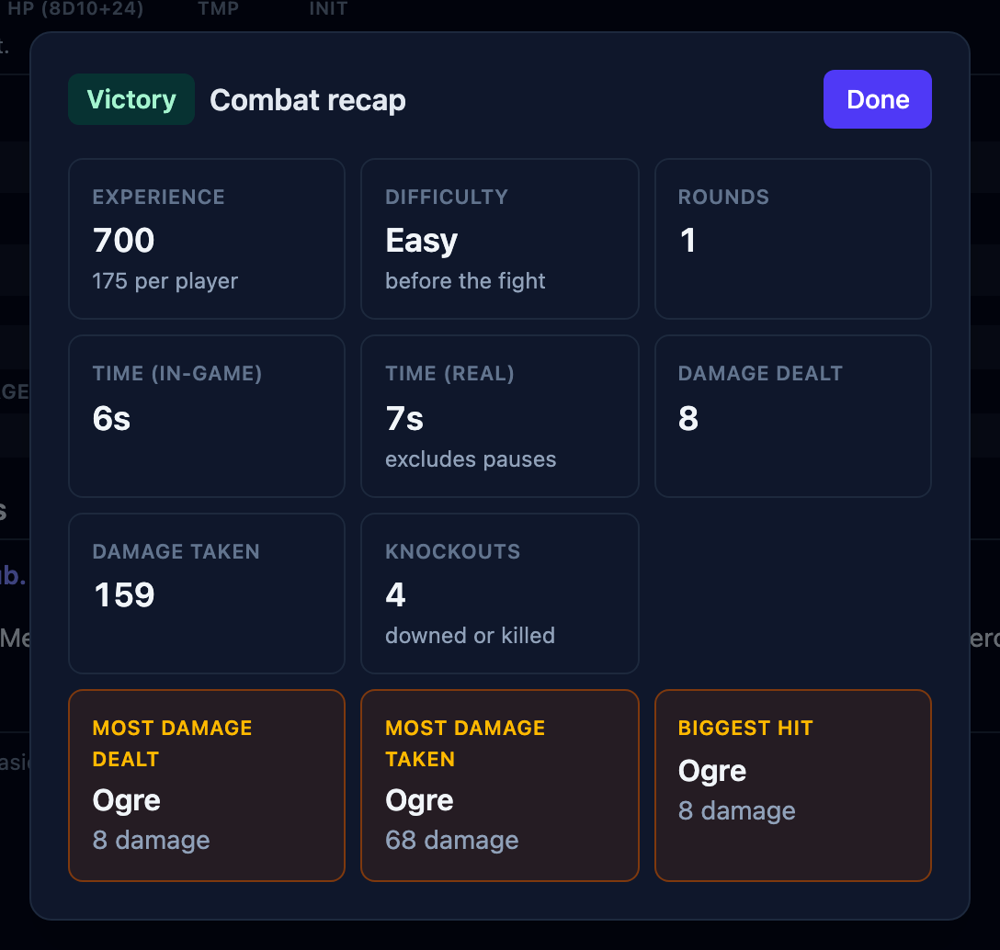

When a fight ends, OpenFray shows a summary of how it went: who won, the experience
points earned, how long it took, and a few standout numbers. This page covers when the
summary appears and what it shows.

## When the summary appears

The summary comes up three ways:

- when you confirm the prompt after the last foe is defeated;
- when you press **Stop** to end the fight;
- when the whole party goes down.

A party wipe only counts once every player is dead or stable. One character still
rolling [death saves](/docs/guides/death/) means the fight is still on.

## What it shows

- **The outcome** — victory, defeat, or simply ended.
- **The difficulty** it was rated at before it began. See
  [How hard the fight looks](/docs/guides/encounters/#how-hard-the-fight-looks).
- **Experience earned**, and what that works out to per player. Only foes pay: a
  creature [fighting for the party](/docs/concepts/combatants/#allies) that went down
  isn't an encounter the party overcame. When your campaign levels up by
  [milestone](/docs/guides/campaigns/#leveling-up-experience-or-milestone), experience
  is left out.
- **How long it took** — rounds, in-game time at six seconds a round, and real time with
  pauses excluded.
- **Total damage** dealt and taken.
- **Knockouts** — how many combatants were downed or killed.
- **Awards** — most damage dealt, most damage taken, and the biggest single hit, each
  shown when the fight produced one.

## Your players see it too

If you're sharing a [player view](/docs/guides/player-view/), the same summary appears
on your players' screens for as long as you leave it open, and their log clears at the
same moment, ready for the next fight. Both are settings; see
[Settings & appearance](/docs/reference/settings/#player-view).

Pressing **Stop** keeps everyone on the board, so you can read the summary and carry on.
To take the board apart for the next fight, see
[Rest & clear the board](/docs/guides/rests/#clearing-the-board).
