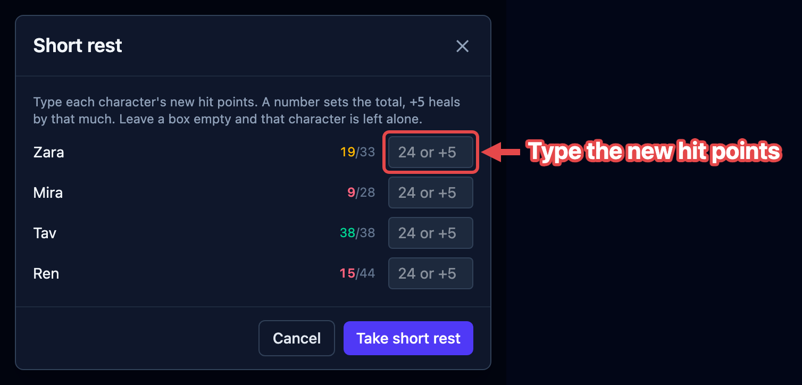
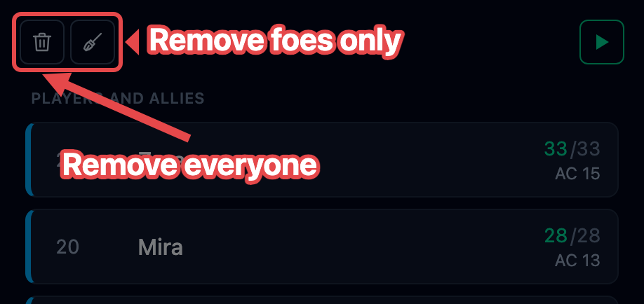

Between fights the party rests, and you clear the board for whatever comes next. This
page covers both. The rest buttons are the **campfire** (short rest) and the **tent**
(long rest), in the top bar to the left of **Group save**.

Rests are disabled while a fight is running. You can't rest mid-combat, so OpenFray
grays them out until you stop. They're grayed out on an empty board too, along with
**Group save** and **Cast spell**: the three keep their places in the bar rather than
disappearing, so you always know where to look for them.

## Short rest

Click the **campfire**. OpenFray doesn't guess how much anyone recovers; it asks you,
because the players are the ones deciding. You get a list of everyone friendly, each
with a box:

In each box you can:

- type a **number** to set that character's hit points outright, as in "I'm on 24 now";
  or
- type **`+7`** to add that much to what they have.

Leave a box empty and that character is left alone. Nobody is healed unless you say so,
and current hit points are tinted by how hurt each one is, so you can see at a glance
who still needs attention.

If you're signed in, OpenFray also counts how many short rests the party has taken since
their last long rest, and puts the number in the corner of the campfire button, at every
width. That count helps with abilities that come back on a short rest. Point at it and
it says what it is.

## Long rest

Click the **tent**, and confirm. This one needs no input. OpenFray applies the lot to
every friendly creature:

- hit points go back to full;
- concentration ends;
- effects set to last less than eight hours are cleared: the 1-minute spell, the
  10-round buff;
- effects of eight hours or more, and anything set to _Until removed_, are kept. Those
  are the ones you're deliberately holding on to, so OpenFray leaves them be;
- the short-rest counter resets.

Foes are untouched.

## Clearing the board

When a fight is over and you're setting up the next one, two buttons at the top of the
tracker sweep it for you. They only appear out of combat, so neither can go off
mid-fight:

- the **broom** removes every foe and keeps your players, for the next fight in the same
  session;
- the **skull** removes everyone and starts fresh. It also clears the game log, so use
  it when you're done with that story entirely.

Both ask before they do it.

:::note[Stop doesn't clear the board]
**Stop** ends the fight but keeps everyone on the board, with their hit points and
effects intact. Use the broom or the skull to take the board apart. See
[Run rounds & turns](/docs/guides/encounters/#rounds-and-turns).
:::
