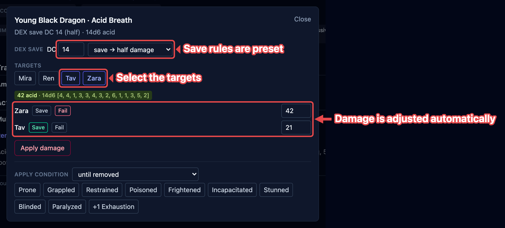
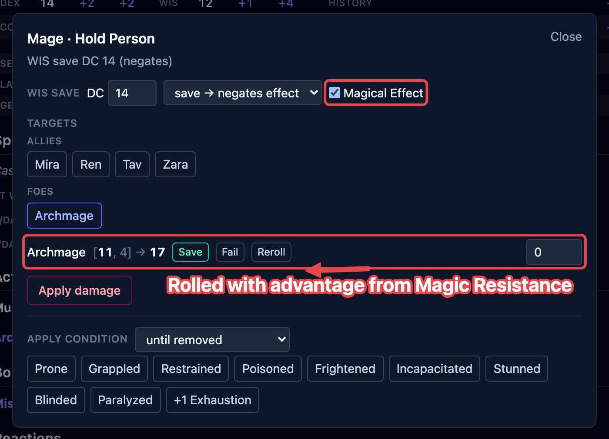
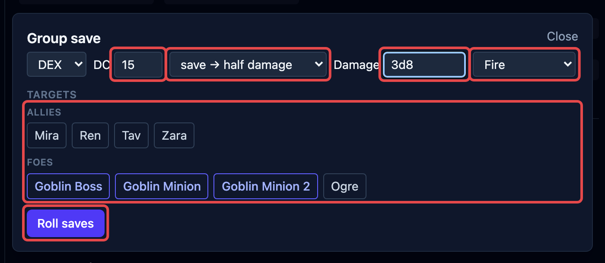

Saving throws come up two ways: an action forces one (a dragon's breath, a creature's
stinger), or a spell makes a whole group roll at once (the _Fireball_ case). Both use
the same box. OpenFray rolls for the creatures, works in their save bonuses, and applies
the damage; players roll their own and you record the result.

## A save forced by an action

1. Select the creature and click the **action** in its stat block. The save box opens,
   already set up from the stat block: the **ability**, the **DC**, and the on-save
   rule: **save → half damage**, **save → no damage**, or **save → negates effect**.
2. Pick the **targets**. Your players and the foes are listed separately.
3. Type the **damage**, either a formula like `8d6` or a flat number.
4. Click **Roll saves**. OpenFray rolls each creature's save; for a player, you record
   what they rolled.

If the action deals damage with no save at all, the box says **Automatic area damage, no
save** and the button reads **Roll damage** instead.

## Magic Resistance and Evasion

Two common defenses are handled for you when they apply:

- **Magical Effect** — a creature with Magic Resistance rolls with advantage against
  spells and other magical effects. The **Magical Effect** toggle marks the save as
  magical; it's pre-checked when a spell forces the save.
- **Evasion** — a creature with Evasion takes no damage on a success and half on a
  failure, instead of the usual half on success. OpenFray shows an **Evasion** marker on
  those creatures and works it into the damage.

## Rerolling one creature's save

Every creature's row carries a **Reroll** button. It rolls that creature's save again
and updates what that creature takes; everyone else keeps the result you've already
settled. The damage itself doesn't change, because one roll is shared by the whole area.

A player's row has no **Reroll**. Their dice stay with them: record what they rolled
with **Save** or **Fail**, and change it there if they roll again.

## Turning a failed save into a success

A creature with **Legendary Resistance** can choose to succeed on a save it failed. When
a creature that has uses left fails, the box offers to turn the failure into a success,
and one tap spends a use. See
[Spend creature resources](/docs/guides/resources/#legendary-resistance).

## Applying the result

Once the saves are rolled:

- Click **Apply damage** to take the damage off everyone at once: full, half, or none
  per creature, following the on-save rule, each creature's resistances and immunities,
  and any Evasion.
- For a save-or-be-affected spell, the box also offers to drop the condition (or the
  spell's effect) on just the creatures that **failed**. **+1 Exhaustion** sits with
  those chips, and raises each failed creature from the level it already carries. See
  [Exhaustion](/docs/guides/effects/#set-an-exhaustion-level).

## Group saves

**Group save** is the standalone version: one spell, a whole group rolling against it at
once, with no action to start from. Open it from the top of the screen, or let a saving
throw spell open it for you.

1. Pick the **ability** and the **DC**, and what a successful save earns: half damage,
   no damage, or the effect simply doesn't happen. Casting a spell fills all of this in.
2. Type the **damage**, either a formula like `8d6` or a flat number if the player
   already rolled it.
3. Pick the **damage type** beside it, such as **Fire** for a _Fireball_. OpenFray then
   works in each target's resistances and immunities, the same way it does for an
   attack. Leave it on **Untyped** and the number lands as you typed it, because there's
   nothing for a defense to match.
4. Choose the targets. Your players and the foes are listed separately.
5. Click **Roll saves**. OpenFray rolls for the creatures; you type what your players
   rolled.
6. Click **Apply damage** to take it off everyone in one click. For a
   save-or-be-affected spell, drop the condition on the ones that failed.

Casting a saving throw spell opens this box already filled in. See
[Cast a spell](/docs/guides/spells/).
