Open [the console](/console/) and choose **Start tutorial** to follow a guided practice
fight. It takes about five minutes and works without an account. This page follows the
same tasks, including what to do when a roll misses or a combatant goes down.

:::caution[Uses your working board]
Tutorial actions change your actual encounter. Exiting keeps everyone you added, damage,
effects, and the log. Start with an empty board and clear the practice fight at the end.
:::

## Start or postpone

The **Learn the console** invitation appears on an empty board outside a fight, after
identity loading and working-board recovery finish. Choose **Start tutorial** to begin,
or **Not now** to postpone for this session.

Tick **Never show this again** to stop automatic invitations, whichever button you choose.
You can still start manually.

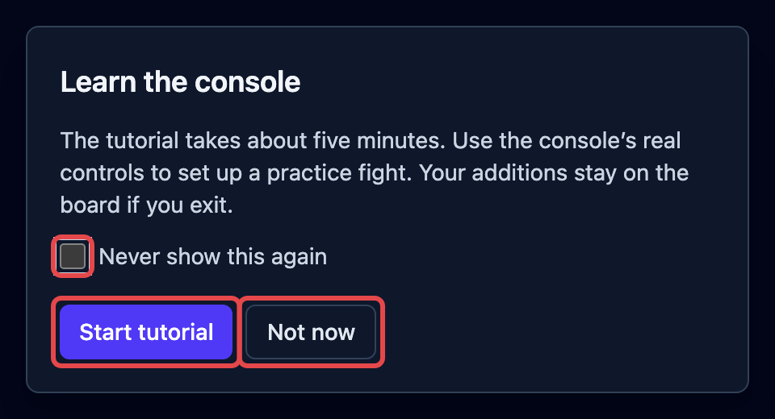

To start manually, open **Settings** from the gear menu, then choose **Start tutorial**
above the tabs. You can also open search with the magnifying glass in the header, type
`tutorial`, and choose **Start tutorial**.

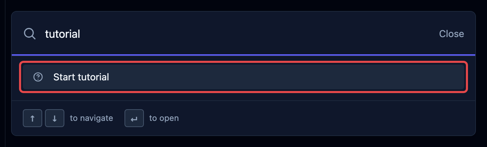

If the board has anyone on it, the console asks you to stop and clear it yourself. It
leaves your board unchanged. Finish or save your current fight before clearing it; see
[Save a fight for later](/docs/guides/saving/).

Enable **Basic Rules 2024 (SRD 5.2.1)** or **Basic Rules 2014 (SRD 5.1)** in
**Settings → Libraries**. The tutorial uses Basic Rules 2024 when both are enabled;
otherwise it uses the enabled Basic Rules edition. It asks you to enable one if neither
is active. Starting leaves your library and campaign choices unchanged.

## Follow the highlighted task

Read the instruction box and use the highlighted controls. The guide advances after a
successful action; there is no separate Next button. Unrelated controls and ordinary
form cancellation are blocked while you follow a task. **Exit tutorial** stays available.

On a phone, open **Add** to find **Add PC**, **Quick add**, and **Add creature**. The guide
switches between the tracker, stat block, and controls as each task needs them. If a control
is still loading, wait; if it is hidden after a screen change, resize or rotate the screen.

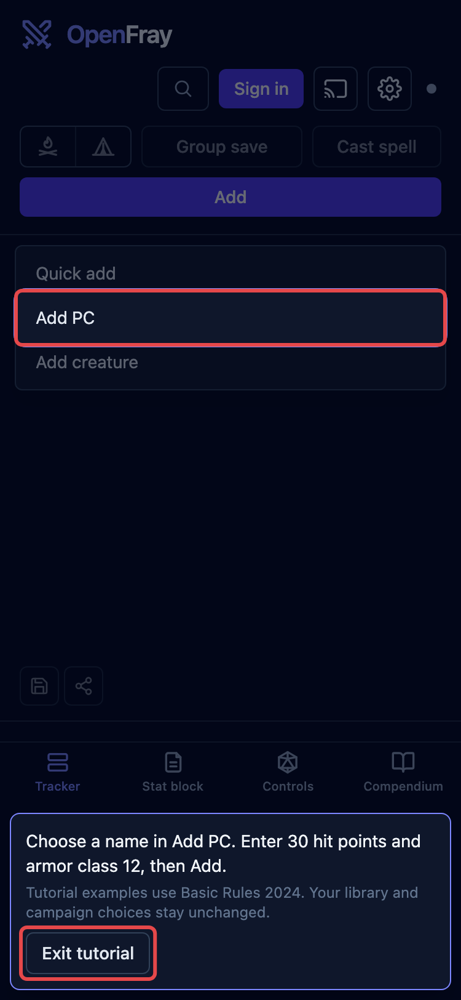

## Add the four combatants

Choose your own names for the player character and friendly quick add. The pictures use
Zara and Mira. The forms require 30 hit points and armor class 12 for both.

### Add your player character

Without an account, open **Add PC**. Enter your chosen name in **PC name**, `30` in
**Max HP**, and `12` in **AC**. Choose **Add** to put the character on the board.

If signed in, create a new roster entry through these controls:

1. Open **Add PC**.
2. Choose **Create a character…**.
3. Choose **Create character** in Characters.
4. Enter your chosen name in **PC name**.
5. Fill the practice values: `30` in **Max HP** and `12` in **AC**.
6. Choose **Create PC**.
7. Choose **Add to encounter** for that new character.

Your signed-in practice character stays in the roster after board clearing. Only its
encounter snapshot is removed. Existing roster characters stay untouched. See
[Creatures, players & quick adds](/docs/concepts/combatants/) for normal character use.

### Add a friendly quick add

Use the lightweight form for the second ally:

1. Open **Quick add**.
2. Enter another chosen name in **Quick add name**.
3. Fill `30` in **Max HP** and `12` in **AC**.
4. Select **Friend** in **Side**.
5. Choose **Add**.

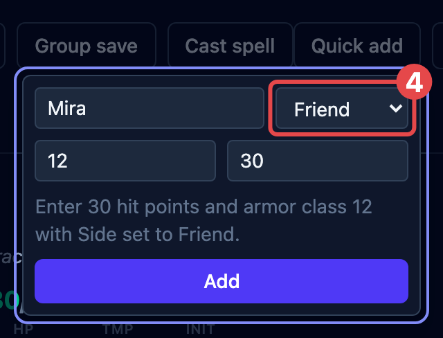

### Add Mage and Ogre

Use the edition named in the instruction box for both creatures:

1. Open **Add creature**.
2. Search for `Mage`.
3. Choose **Mage** from the selected Basic Rules library.
4. Open **Add creature** again.
5. Search for `Ogre`.
6. Choose **Ogre** from the same library.

## Enter initiative

Choose **Begin**, the play icon at the top of the tracker. In **Roll initiative**, type a
whole-number initiative for every combatant, including Mage and Ogre. Then choose
**Start combat**.

For example, enter `20` for your player character, `19` for the quick add, `18` for Mage,
and `17` for Ogre. The tutorial requires all four entries. In normal use, creatures and
quick adds arrive with rolls filled in, and you enter your players’ results.

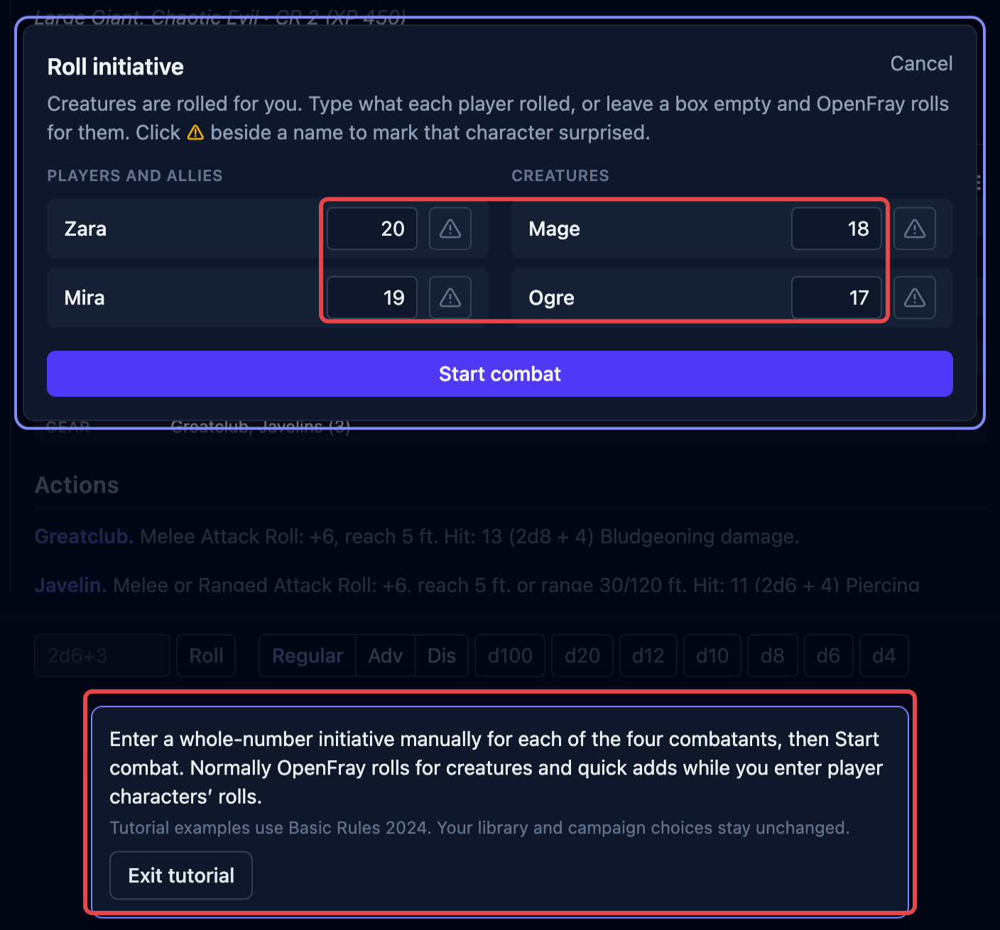

## Record damage and resolve an attack

Start with a player-reported roll made outside the console. Choose the Ogre’s current hit
points in its tracker row, type `-3`, and press `Enter`. This records 3 damage. For other
hit-point changes, see [Changing hit points](/docs/reference/tracker/#changing-hit-points).

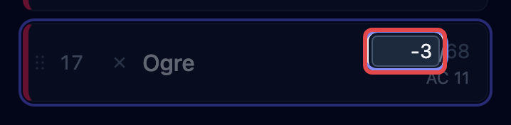

Resolve the Ogre’s attack through the highlighted stat-block control:

1. Choose **Javelin** in the Ogre’s stat block.
2. Select your player character as its target.
3. Choose **Roll attack**.

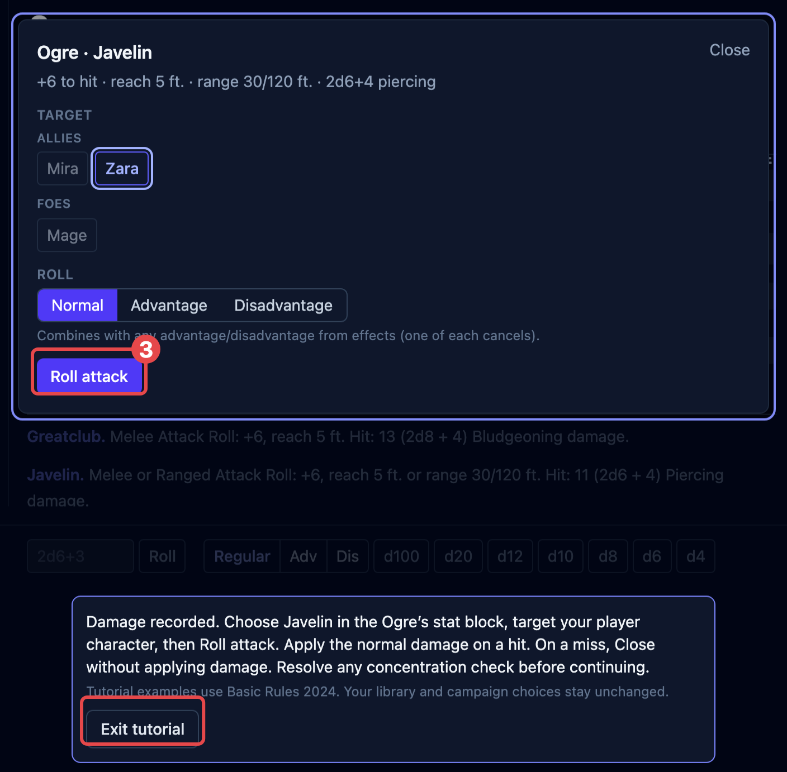

On a hit, choose **Apply to** followed by your character’s name. On a miss, choose **Close**
without applying damage. A critical hit uses the normal critical damage. Keep the actual
result; a miss advances the lesson without another roll. Finish any concentration check
that appears. A downed character keeps that result on the board.

[Resolve an attack](/docs/guides/attacks/) explains the normal attack controls and damage
application.

## Apply Prone

Choose **Apply effect** for Ogre in its controls beside the stat block. Select **Prone**,
then choose **Apply**. Selecting the condition stages it; **Apply** puts it on the board.
The guide applies it after the attack, so it leaves that attack’s roll unchanged.

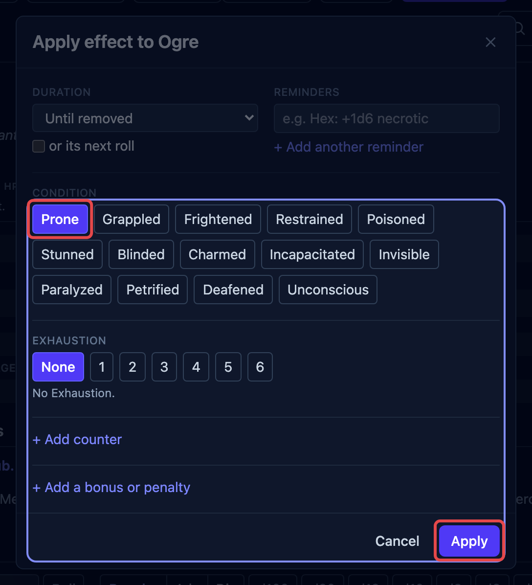

See [Apply & manage effects](/docs/guides/effects/) for durations, reminders, and other
conditions.

## Cast the Mage’s Fireball

Choose **Fireball** in the Mage’s stat block, then **Cast** in the spell card. Use this
creature control for the tutorial; the separate top-bar **Cast spell** button serves the
normal general casting flow.

The Mage spends a daily use in Basic Rules 2024, or a spell slot in Basic Rules 2014.
The spell card shows the remaining uses before casting.

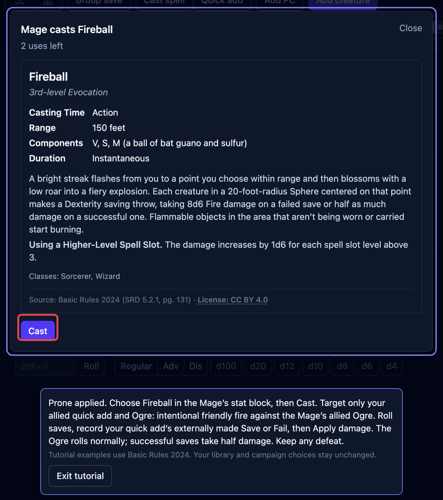

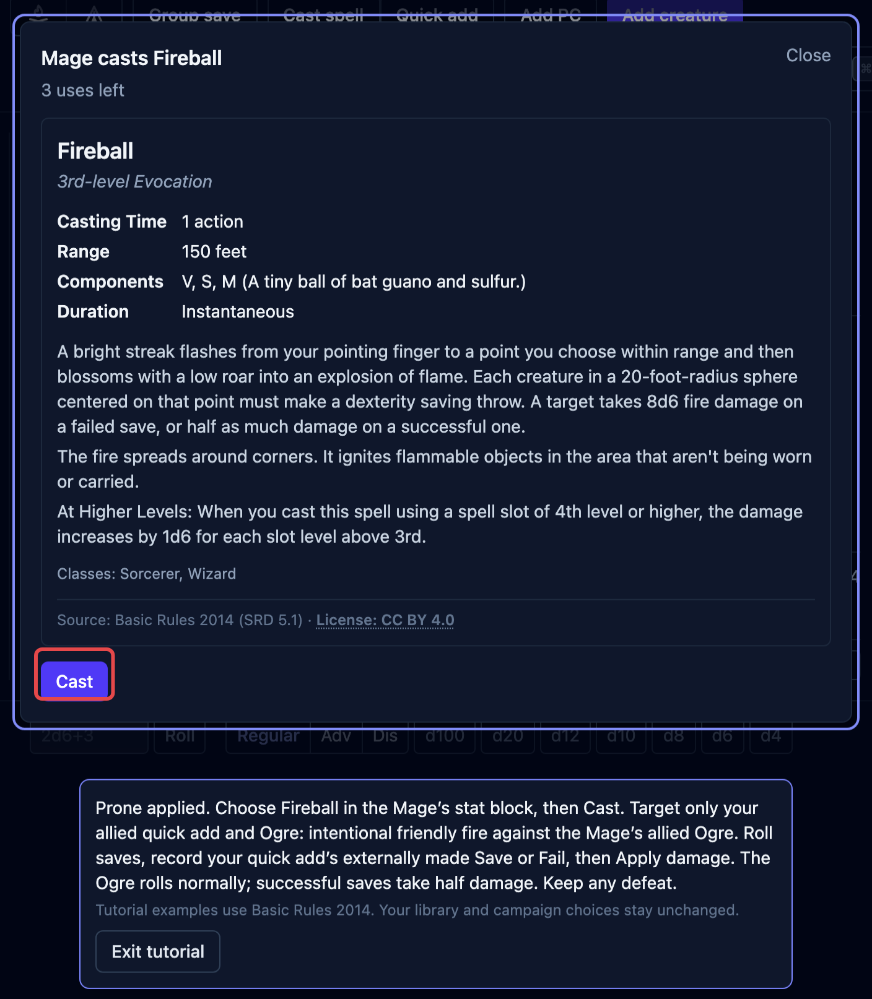

Resolve the spell against exactly two targets:

1. Select your friendly quick add and **Ogre**. This practice example deliberately includes
   friendly fire against the Mage’s allied Ogre.
2. Choose **Roll saves**. The console makes the Ogre’s saving throw and rolls the spell’s damage.
3. Record your quick add’s externally made saving throw with **Save** or **Fail** on its row.
4. Choose **Apply damage**. Successful saves take half damage; failed saves take full damage.

The picture records a sample externally reported successful save for Mira. Your own result
can succeed or fail. Keep the Ogre’s rolled result and any defeated combatant.

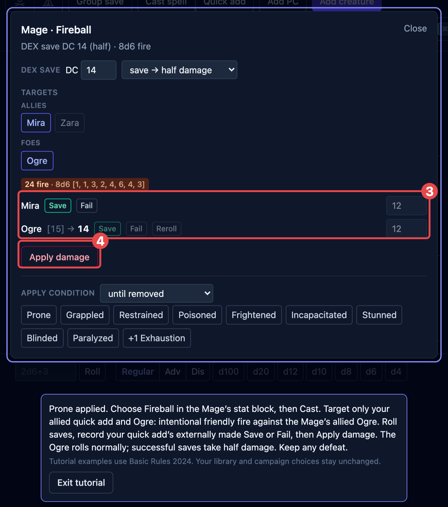

See [Cast a spell](/docs/guides/spells/) for normal casting and
[Roll saving throws](/docs/guides/saves/) for save resolution.

## Advance and stop

Choose **Next turn** at the top of the tracker after spell damage is applied. The initiative
marker advances. Dead creatures are skipped; unconscious player characters and quick adds
still take turns for death saves.

If the guide asks for a death save, record its actual result with **Save** or **Fail**, or
use **Roll death save**. Continue with **Next turn** as instructed. Recovery, stabilization,
and death keep their normal results. See [Handle death & dying](/docs/guides/death/).

Choose **Stop**, beside the turn controls, when the guide asks you to end the fight.
**Pause** only holds it. Choose **Done** in **Combat recap**. Stopping leaves everyone and
the log on the board; [End the fight](/docs/guides/recap/) covers the recap.

If the fight already ended automatically, dismiss its recap with **Done** and continue to
clearing. The guide does not ask you to restart the fight or click an unavailable **Stop**.
If an end prompt appears, **Keep fighting** continues, or **End combat** opens the recap.

## Clear and finish

Use the trash icon at the top of the tracker, named **Remove everyone and clear the log**.
Your browser opens its own confirmation. Confirm to remove everyone and clear the log.

Canceling that confirmation leaves cleanup pending. The board and log remain, and you can
retry the trash control or choose **Exit tutorial**. The browser confirmation is outside
the console’s highlighted controls.

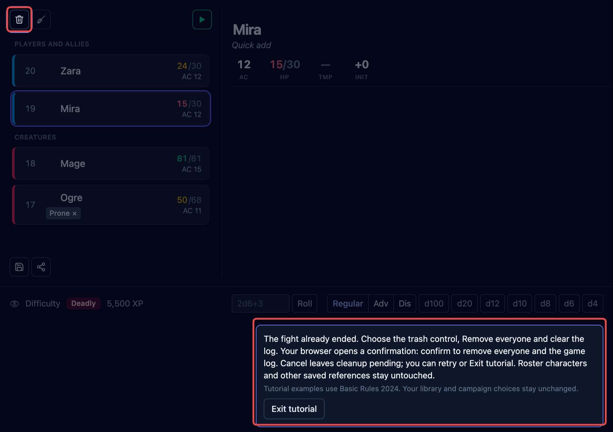

The tutorial finishes only after the fight has ended, outcome dialogs are dismissed, and
both the combatants and game log are empty. Clearing keeps roster characters and saved
references, and does not reset unrelated encounter details.

Without an account, choose **Continue without an account**. When sign-in is available,
**Sign in** opens the existing **Continue with Google** and **Continue with Discord**
choices. This invitation appears only after clearing, never on early exit. If sign-in is
unavailable on your copy, continuing without an account still works.

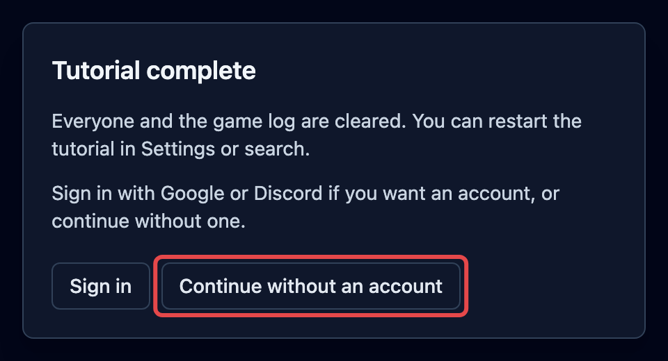

Signed-in completion has no sign-in invitation and reminds you that the practice character
stays in your roster. Completion stops future automatic invitations; see
[Tutorial invitation preferences](/docs/concepts/account/#tutorial-invitation-preferences)
for device and account storage, including save failures.

## Exit and replay

Choose **Exit tutorial** at any task to answer **Offer the tutorial again another time?**:

- **Yes, another time** exits and postpones invitations for this session.
- **Never show again** exits and stops automatic invitations permanently.
- **Return to tutorial** cancels the exit and returns to the current task.

Exiting preserves committed actions and does not count as completion.

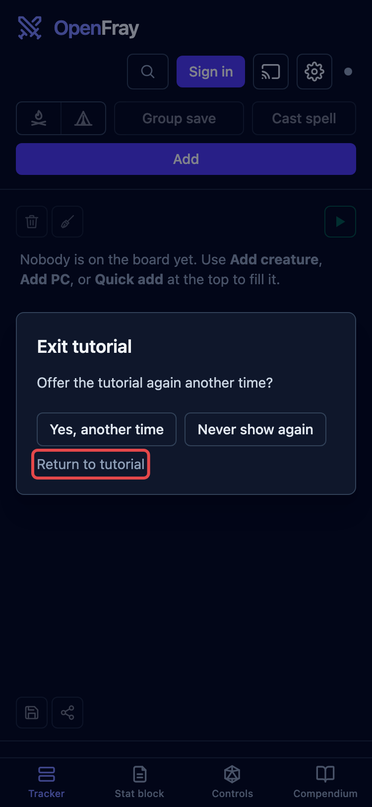

To replay, stop and clear the board yourself, then choose **Start tutorial** in Settings
or search. Manual entry works after completion or permanent dismissal. Every replay starts
at **Add PC**; the guide stores no step progress. Reloading removes active guidance while
normal working-board recovery keeps committed actions. Each completed anonymous replay
can offer optional sign-in again after clearing.

## Where to next

Use these pages for your own encounters:

- [Run rounds & turns](/docs/guides/encounters/) — turn order and fight controls.
- [Rest & clear the board](/docs/guides/rests/) — cleanup outside the tutorial.
- [Your account & what’s saved](/docs/concepts/account/) — saved content and account choices.
