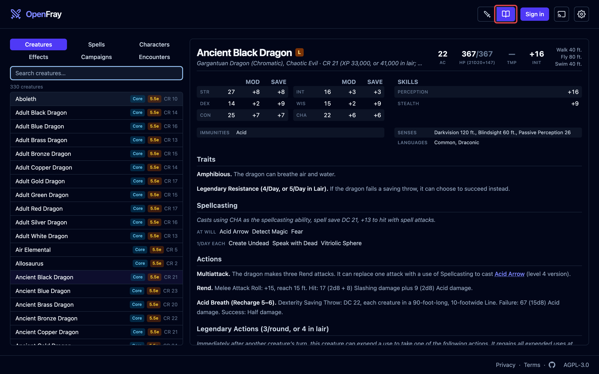
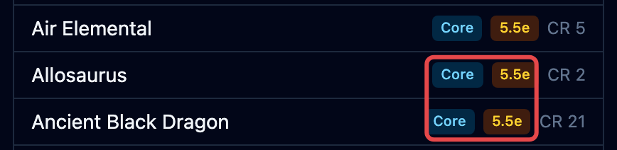
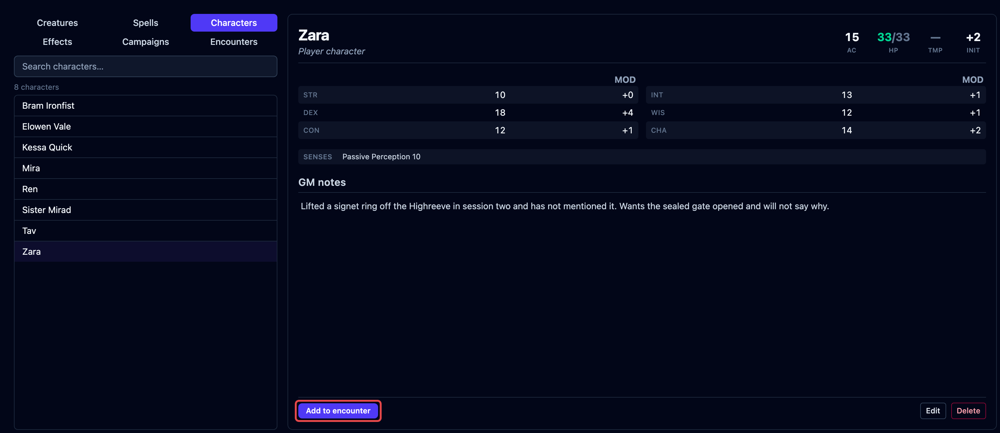

The **compendium** is the reference OpenFray keeps for you: every creature, spell, and
effect preset in the libraries you use, plus your saved characters and campaigns. Open
it with the **book** at the top of the screen; the same button switches you back to the
fight.

The screen has three parts:

- **The tabs** — **Creatures**, **Spells**, **Characters**, **Effects**, and
  **Campaigns**.
- **The list** — search by name; every match shows here.
- **The reading pane** — the full stat block or card of what you picked, in the same
  layout you see during a fight.

Each row in the list is badged with where it came from, so you always know which book
and which rules you're looking at:

## Creatures

Every creature in the [libraries you've turned on](#libraries), with its full stat
block. This is the same list you pick from when you click **Add creature**. A creature
you built yourself is badged **Custom**.

## Spells

Every spell in the libraries you've turned on, with its full card: casting time, range,
components, how long it lasts, and what it does. You see the same card when you cast a
spell, or when you point at a spell name inside a stat block.

## Characters

Your saved players. Build a character once, with armor, hit points, abilities,
resistances, senses, and private GM notes, then drop them into any fight instead of
typing them in again.

The campaign each character belongs to shows beside their name in the list, so a table's
party stays recognizable when you run more than one game. Click **Add to encounter** to
put a character straight on the tracker.

:::note[Needs an account]
Saving and reusing player characters requires signing in with a free Google or Discord
account.
:::

## Effects

The effect presets you can apply during a fight: ready-made bundles like a disease stage
or a level of Intoxication. The list holds the presets your libraries ship and the ones
you've saved yourself; pick one to read exactly what it applies. You use them from
**Apply effect** during a fight. See [Presets](/docs/guides/effects/#presets).

## Campaigns

Your games and their house rules. Each campaign's card lists its rules at a glance. See
[Set up a campaign & house rules](/docs/guides/campaigns/).

## Libraries

The compendium shows the books you've turned on in
[Settings](/docs/reference/settings/#libraries). OpenFray ships with:

- **Basic Rules 2024** (DnD 5.5e) — the newer rules. On by default.
- **Basic Rules 2014** (DnD 5e) — the older rules. Turn this on if that's what your
  table plays.
- **Tome of Beasts 1, 2, and 3** (DnD 5e) — three books of extra creatures from Kobold
  Press.
- **Creature Codex** (DnD 5e) — a fourth Kobold Press bestiary, around 350 more
  creatures.
- **Brood & Bloom** (DnD 5.5e) — OpenFray's own, a bestiary of parasites in three
  broods. One lives in people, one takes ground and buildings, and one wants only the
  dead. It also carries the Lazaret, the order that catalogs and treats them.
- **On Strong Waters and Potent Simples** (DnD 5.5e) — OpenFray's own, an apothecary's
  book of drink and drugs. It adds eleven spells and a set of ready-made effect presets
  for the intoxication, craving, and addiction it counts. It adds no creatures.
- **The Waking Garden** (DnD 5.5e) — OpenFray's own, a bestiary of vegetables that have
  woken up, across three stages of growth.
- **Homebrew creations** — everything you build or import yourself. On by default.

Some spells differ between the two versions of the rules (_Barkskin_'s armor class, how
_Sleep_ works). Each library carries its own version, so you get the one that matches
what you're playing.

## Homebrew content

You can build your own creatures and spells in a full editor, and they're kept in your
library next to the built-in ones. See
[Build your own creatures & spells](/docs/guides/making-your-own/). To bring a
D&D&nbsp;Beyond creature across without retyping it, see
[Import from D&D Beyond](/docs/guides/importer/).

:::note[Where the rules come from]
The built-in rules come from the official System Reference Document, used under the
CC-BY-4.0 license. The Tome of Beasts books are used under the Open Game License.
Brood & Bloom, The Waking Garden, and On Strong Waters and Potent Simples are written
for OpenFray: their stat blocks and spells are CC-BY-4.0, and their lore, art, and prose
stay ours. Full credit for every source is in the app. OpenFray is compatible with 5.5e
(2024) and 5e (2014) and isn't made or approved by Wizards of the Coast.
:::
