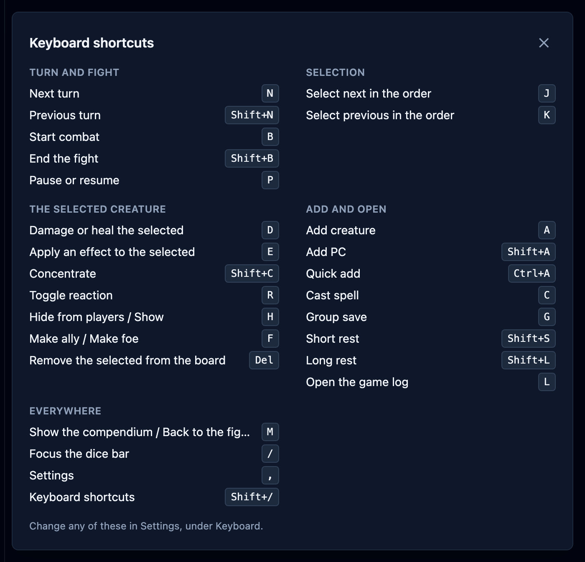

Most of what you do in a fight has a key. You can step the turn, walk the tracker,
damage whoever is selected, and open any of the panels without reaching for the mouse.
This page lists every command and the key it starts with. You can change any of them,
which is covered in
[Settings & appearance](/docs/reference/settings/#keyboard).

## See them in the app

Press `Shift+/` to open the cheat sheet, or click the **gear** at the top right and
choose **Keyboard shortcuts**. It lists every command with the key it currently answers
to, grouped the way this page groups them. Press `Escape` to close it.

The buttons themselves carry their key too. Hover one and its tooltip names the chord,
so you can pick the shortcuts up as you go.

## Turn and encounter

These run the fight itself. All but **Start combat** need a fight already under way.

| Command           | Key       |
| ----------------- | --------- |
| Next turn         | `N`       |
| Previous turn     | `Shift+N` |
| Start combat      | `B`       |
| End the encounter | `Shift+B` |
| Pause or resume   | `P`       |

**Next turn** does everything the button does, so recharge rolls and effects that end on
a turn still happen.

## Selection

These move the highlight down and up the tracker, in the order you see it. Hold the key
to keep moving. The selection wraps around at either end.

| Command                      | Key |
| ---------------------------- | --- |
| Select next in the order     | `J` |
| Select previous in the order | `K` |

During a fight the order runs through the living in initiative order, with the dead
grouped below. Before a fight it runs through players and allies first, then creatures.

## The selected creature

These act on the creature the console is showing: the one you clicked, or whoever's turn
it is if you haven't clicked anyone.

| Command                            | Key       |
| ---------------------------------- | --------- |
| Damage or heal the selected        | `D`       |
| Apply an effect to the selected    | `E`       |
| Concentrate                        | `Shift+C` |
| Toggle reaction                    | `R`       |
| Hide from players / Show           | `H`       |
| Make ally / Make foe               | `F`       |
| Remove the selected from the board | `Del`     |

`D` puts the cursor straight in the hit points box, so you can type the damage and press
`Enter`. See [Resolve an attack](/docs/guides/attacks/).

## Add and open

These open a panel or a picker on the fight screen.

| Command           | Key       |
| ----------------- | --------- |
| Add creature      | `A`       |
| Add PC            | `Shift+A` |
| Quick add         | `Ctrl+A`  |
| Cast spell        | `C`       |
| Group save        | `G`       |
| Short rest        | `Shift+S` |
| Long rest         | `Shift+L` |
| Open the game log | `L`       |

**Short rest** and **Long rest** work only before a fight starts. **Cast spell** and
**Group save** need at least one creature on the board.

## Everywhere

These work on any screen.

| Command                                     | Key       |
| ------------------------------------------- | --------- |
| Show the compendium / Back to the encounter | `M`       |
| Focus the dice bar                          | `/`       |
| Settings                                    | `,`       |
| Keyboard shortcuts                          | `Shift+/` |

## When a shortcut does nothing

The keyboard steps out of the way whenever a key belongs to something else:

- **While you're typing.** Every key is yours inside a text box, a number box, or a
  dropdown. Click away, or press `Escape`, to get the shortcuts back.
- **While a dialog or a menu is open.** The panel in front owns the keyboard until you
  close it.
- **When the command can't run.** A shortcut whose command isn't available right now
  does nothing at all, with no warning. Pressing `B` mid-fight is an example: the fight
  has already started.

`Enter` is the exception that works the other way round. Inside a fight dialog, it runs
that dialog's main button, so you can type a number and commit without reaching for
**Apply** or **Save**.

## Keys OpenFray won't take

Four keys can never carry a command, because the browser and the screen reader already
use them: `Enter`, `Space`, `Tab`, and `Escape`.

Anything held with `Cmd` (or `Alt`) goes straight to your browser and the operating
system, so those combinations are never bindable. The browser's own `Ctrl` chords are
off limits too, among them `Ctrl+C`, `Ctrl+V`, `Ctrl+S`, `Ctrl+F`, `Ctrl+P`, and
`Ctrl+R`. `Ctrl+A` is the one exception: **Quick add** holds it, and select-all still
works inside every text box, because the keyboard stands down while you type.

Any of these keys can be swapped for one you'd rather use, on the **Keyboard** tab in
Settings. The steps are in
[Settings & appearance](/docs/reference/settings/#keyboard).
