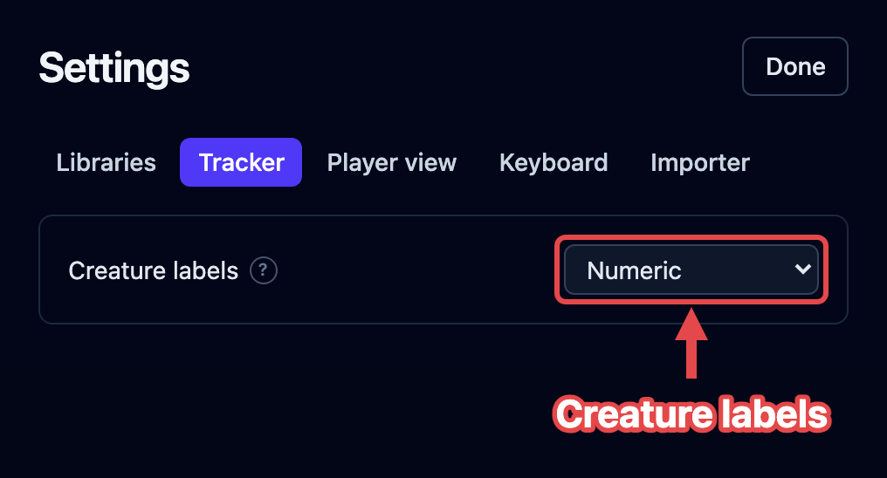
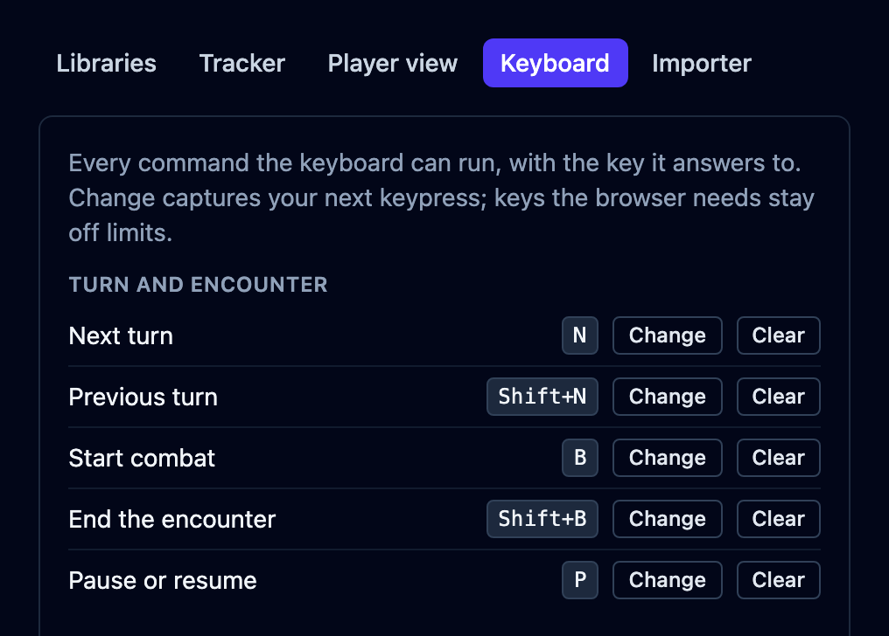

Some things live outside the fight: which **libraries** you play with, how much your
players see on the screen you share with them, which keys run which commands, and
whether the app is light or dark. They're set once and remembered in your browser, with
no account needed. Click the **gear** at the top right and choose **Settings**. The same
menu holds the light and dark switch, the keyboard cheat sheet, a link to this handbook,
and **Report a bug**, which opens a new issue on GitHub.

Settings opens on five tabs (**Libraries**, **Tracker**, **Player view**, **Keyboard**,
and **Importer**) and starts on Libraries.

## Libraries

OpenFray ships with more than one edition of the rules, and with extra books of
creatures. On the **Libraries** tab, tick the ones your table uses. The list is grouped
into **Core**, **OpenFray**, and **Other**:

- **Basic Rules 2024 (SRD 5.2.1)** — the newer rules. On by default.
- **Basic Rules 2014 (SRD 5.1)** — the older rules. Turn this on if that's what your
  table plays.
- **Brood & Bloom**, **The Waking Garden**, and **On Strong Waters and Potent Simples**
  are OpenFray's own books. Their names are links: click one to read the book itself, in
  a new tab.
- **Homebrew creations** — your own creatures and spells, on by default. Turn it off to
  shelve them all at once.
- **Tome of Beasts 1, 2, and 3** and **Creature Codex** are four bestiaries from Kobold
  Press.

What each book contains is covered in
[The compendium](/docs/reference/compendium/#libraries), along with where the rules come
from. A **Sort by** dropdown under the list orders it by name or by group.

Whatever you turn on shows up in the compendium, in the **Add creature** list, and in
the **Cast spell** list, each entry badged with where it came from. The choice is
remembered in your browser, so it sticks whether or not you're signed in.

## Tracker

Open the **Tracker** tab and choose **Creature labels** to set how repeated creatures
are labeled:

| Style                 | Examples                        |
| --------------------- | ------------------------------- |
| **Numeric** (default) | Goblin 1, Goblin 2, Goblin 3    |
| **Roman numerals**    | Goblin I, Goblin II, Goblin III |
| **Letters**           | Goblin A, Goblin B, Goblin C    |

A single creature keeps its name. Adding a second matching creature labels both.
Removing creatures leaves the remaining labels unchanged. Changing the style affects
new labels; existing labels and names you type stay as they are. Letters continue after
Z as AA, AB, and so on.

## Player view

The **player view** is a read-only screen your players follow on their own devices. Its
tab decides how much of a fight reaches them:

| Setting                              | What you can choose                         | Starts as           |
| ------------------------------------ | ------------------------------------------- | ------------------- |
| **Creature hit points**              | In words (Bloodied) · Exact number · Hidden | In words            |
| **Creature armor class**             | Hidden · Shown                              | Hidden              |
| **Creature rolls**                   | Shown · Hidden                              | Shown               |
| **Creature conditions**              | Shown · Hidden                              | Shown               |
| **Creatures arriving mid-encounter** | Shown · Hidden until revealed               | Shown               |
| **Game log**                         | This encounter only · The whole session     | This encounter only |
| **Encounter clocks**                 | Shown · Hidden                              | Shown               |
| **End-of-encounter summary**         | Shown · Hidden                              | Shown               |
| **Campaign name**                    | Shown · Hidden                              | Hidden              |
| **Game Master name**                 | Shown · Hidden                              | Hidden              |

Player characters always show in full, whatever you pick here, and so does anyone
fighting alongside them. Every choice reaches your players' screens straight away,
mid-fight included. Any single creature can also be hidden or revealed on its own, from
its controls beside the stat block.

The last two put a line at the top of your players' screen: the campaign's name, and
**Run by** your profile name. Both start off, and the Game Master's name needs an
account, because an anonymous link has no name to send.

A **?** beside a setting's label explains what it does. Point at it, or tap it on a
touchscreen. Anything written in plain sight beside a control instead is telling you
something about its state.

Sharing itself is the **cast** button in the top bar. See
[Share the player view](/docs/guides/player-view/), which explains each choice.

## Keyboard

Nearly every command in the console has a key, and the **Keyboard** tab is where you
change which one. It lists all 26 commands in the same five groups the cheat sheet uses,
each with the key it currently answers to. For the full list of what the keys do, see
[Keyboard shortcuts](/docs/reference/keyboard/).

To give a command a different key:

1. Click **Change** on its row. The button reads **Press a key…** while it waits.
2. Press the key you want. Hold **Shift** or **Ctrl** with it for a longer chord.
3. Check the row. The new key shows beside the command straight away.

A key that's already taken is refused, and a line under the row names the command
holding it. Keys the browser needs for itself are refused the same way. Press `Escape`
to back out without changing anything.

**Clear** takes a command's key away, leaving it **Not set**. The command still works
from its button. **Restore defaults**, at the bottom of the tab, puts every key back at
once and asks you to confirm first.

:::note[Saved on this device]
Your keys are remembered in this browser, like the light and dark choice. They don't
travel with your account, so another computer starts from the defaults.
:::

## Light or dark

Click the **gear** at the top right, then **Light mode** or **Dark mode**. The row names
the one you'd switch to. OpenFray opens dark by default. Your choice is remembered in
your browser, and it's shared with the OpenFray website, so both match.

## The importer

The **Importer** tab links to the **OpenFray Importer**, a free browser add-on that
turns a D&D&nbsp;Beyond creature page into an OpenFray creature. There's a button for
each browser it's published for: **Get it for Chrome** and **Get it for Firefox**. See
[Import from D&D Beyond](/docs/guides/importer/).
