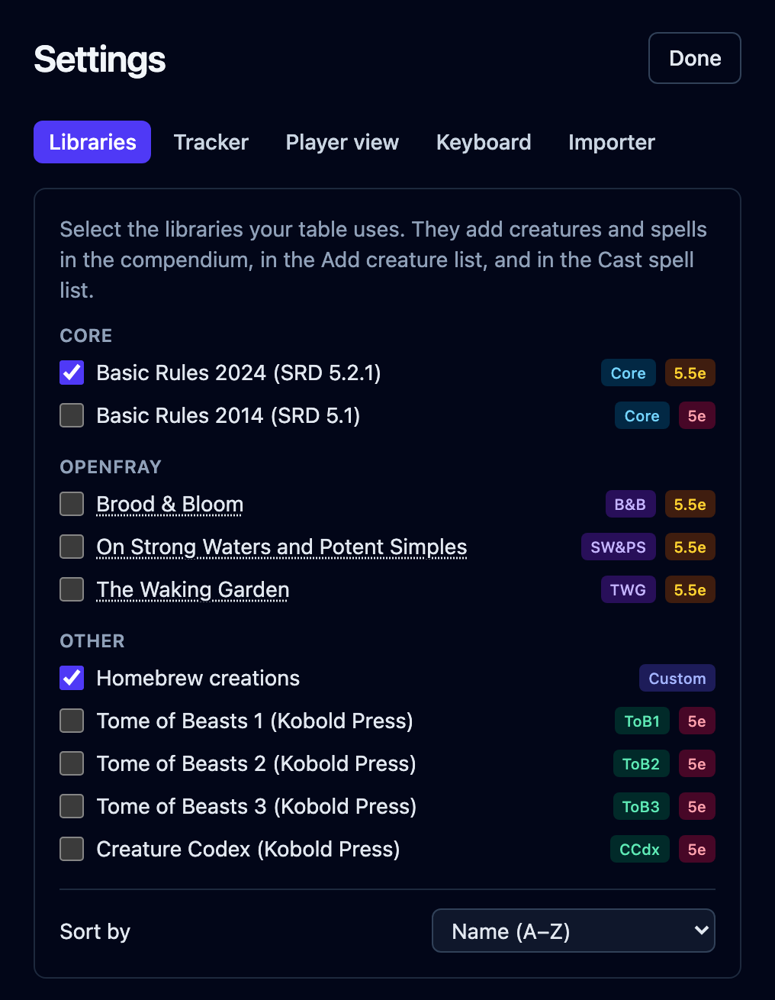
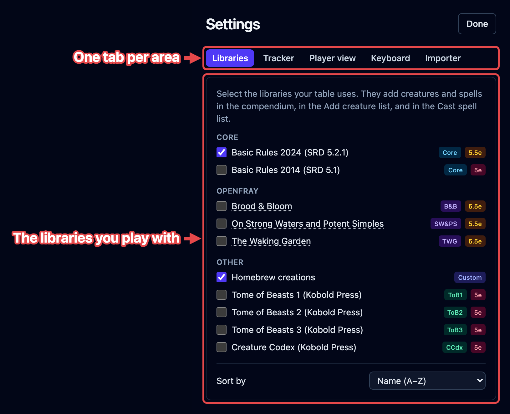
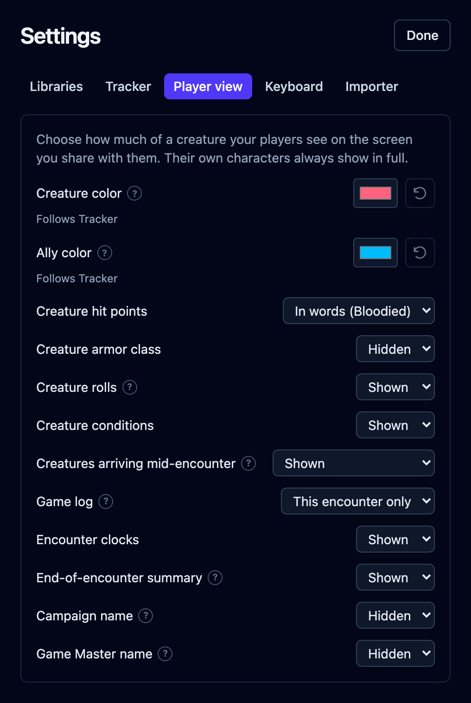
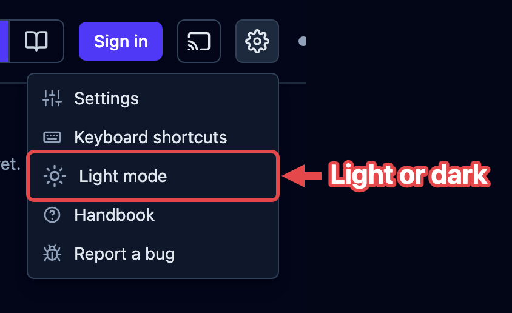

Some things live outside the fight: which **libraries** you play with, how much your
players see on the screen you share with them, and whether the app is light or dark.
They're set once and remembered in your browser, with no account needed. Click the
**gear** at the top right and choose **Settings**. The same menu holds the light and
dark switch, a link to this handbook, and **Report a bug**, which opens a new issue on
GitHub.

Settings opens on three tabs (**Libraries**, **Player view**, and **Importer**) and
starts on Libraries.

## Libraries

OpenFray ships with more than one edition of the rules, and with extra books of
creatures. On the **Libraries** tab, tick the ones your table uses. The list is grouped
into **Core**, **OpenFray**, and **Other**:

- **Basic Rules 2024 (SRD 5.2.1)** — the newer rules. On by default.
- **Basic Rules 2014 (SRD 5.1)** — the older rules. Turn this on if that's what your
  table plays.
- **Brood & Bloom**, **The Waking Garden**, and **On Strong Waters and Potent
  Simples** — OpenFray's own books. Their names are links: click one to read the book
  itself, in a new tab.
- **Homebrew creations** — your own creatures and spells, on by default. Turn it off to
  shelve them all at once.
- **Tome of Beasts 1, 2, and 3** and **Creature Codex** — four bestiaries from Kobold
  Press.

What each book contains is covered in
[The compendium](/docs/reference/compendium/#libraries), along with where the rules come
from. A **Sort by** dropdown under the list orders it by name or by group.

Whatever you turn on shows up in the compendium, in the **Add creature** list, and in
the **Cast spell** list, each entry badged with where it came from. The choice is
remembered in your browser, so it sticks whether or not you're signed in.

## Player view

The **player view** is a read-only screen your players follow on their own devices. Its
tab decides how much of a fight reaches them:

| Setting                          | What you can choose                         | Starts as       |
| -------------------------------- | ------------------------------------------- | --------------- |
| **Creature hit points**          | In words (Bloodied) · Exact number · Hidden | In words        |
| **Creature armor class**         | Hidden · Shown                              | Hidden          |
| **Creature rolls**               | Shown · Hidden                              | Shown           |
| **Creature conditions**          | Shown · Hidden                              | Shown           |
| **Creatures arriving mid-fight** | Shown · Hidden until revealed               | Shown           |
| **Game log**                     | This fight only · The whole session         | This fight only |
| **Fight clocks**                 | Shown · Hidden                              | Shown           |
| **End-of-fight summary**         | Shown · Hidden                              | Shown           |

Player characters always show in full, whatever you pick here, and so does anyone
fighting alongside them. Every choice reaches your players' screens straight away,
mid-fight included. Any single creature can also be hidden or revealed on its own, from
its controls beside the stat block.

Sharing itself is the **screen** button in the top bar. See
[Share the player view](/docs/guides/player-view/), which explains each choice.

## Light or dark

Click the **gear** at the top right, then **Light mode** or **Dark mode**. The row names
the one you'd switch to. OpenFray opens dark by default. Your choice is remembered in
your browser, and it's shared with the OpenFray website, so both match.

## The importer

The **Importer** tab links to the **OpenFray Importer**, a free browser add-on that
turns a D&D&nbsp;Beyond creature page into an OpenFray creature. There's a button for
each browser it's published for: **Get it for Chrome** and **Get it for Firefox**. See
[Import from D&D Beyond](/docs/guides/importer/).
