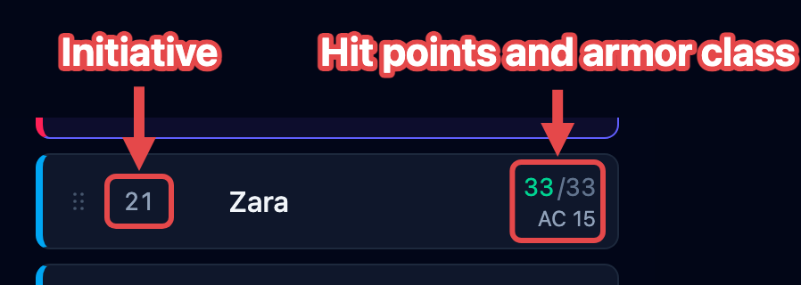

The **tracker** is the list of everyone in the fight, in initiative order. On a laptop
it's the left column; on a phone it's the **Tracker** screen on the bottom bar. This
page describes what a row shows and what you can do from it.

Before the fight starts, the tracker holds two groups, **Players and allies** and
**Creatures**, so you can see both sides at a glance. When the fight begins, everyone
merges into one list in initiative order.

## Reading a row

Every row holds the four things you check most often: initiative, name, hit points, and
armor class.

Around those four, a row can carry:

- **Effect badges** under the name, one per effect or bundle. See
  [How effects work](/docs/concepts/effects/#where-effects-show).
- A **C** badge while the combatant concentrates on a spell. See
  [Track concentration](/docs/guides/concentration/).
- A **Hidden** tag when you're keeping the combatant off the shared
  [player view](/docs/guides/player-view/#when-a-creature-appears). Combatants simply
  waiting for the fight to start aren't tagged; they reach your players on their own
  when you press **Begin**.
- An **Unconscious** or **Stable** tag, with the death-save pips, when a player
  character is down. See [Handle death & dying](/docs/guides/death/).
- A **remove** (×) that takes the combatant off the board.
- A **drag handle** (six dots, far left) once the fight runs. See
  [Rearranging the order](/docs/guides/encounters/#rearranging-the-order).

During a fight, the creature whose turn it is glows, and its stat block fills the middle
of the screen. Click any row to select that combatant and act on it.

## Changing hit points

Click a combatant's current hit points to change them. You can:

- type a **number** to set the total outright: `24`;
- type **`+5`** to heal by that much;
- type **`-8`** to deal that much damage.

Current hit points change color as a creature gets hurt, so you can spot a badly wounded
one at a glance. Temporary hit points are counted separately and consumed first when a
combatant takes damage.

The video below shows each form typed into a row, and the tint following the damage:

<video controls preload="none" poster="/docs/videos/type-hit-points.jpg" width="451" height="235" style="max-width:100%; height:auto; border-radius:0.6rem;">
  <source src="/docs/videos/type-hit-points.mp4" type="video/mp4" />
</video>

:::tip[Damage from a player]
Typing `-8` is the quick way to apply damage from a player to a creature. When a
creature attacks, [resolve the attack](/docs/guides/attacks/) instead. OpenFray rolls
the damage, applies resistances, and takes the hit points off for you.
:::

## Rearranging the order

Once a fight is running, you can drag a row to a new spot in the initiative order, for a
held action or to fix a number you typed wrong. The steps are in
[Run rounds & turns](/docs/guides/encounters/#rearranging-the-order).

